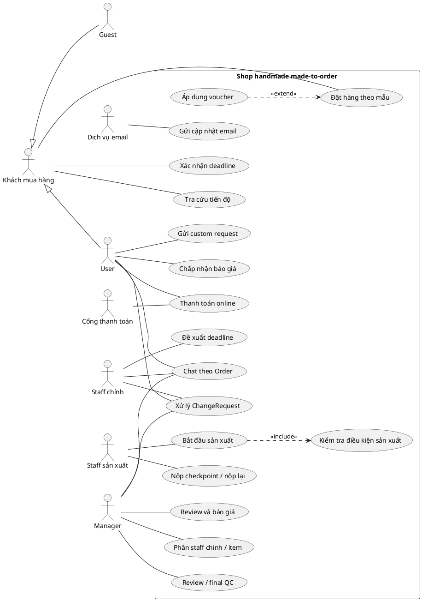
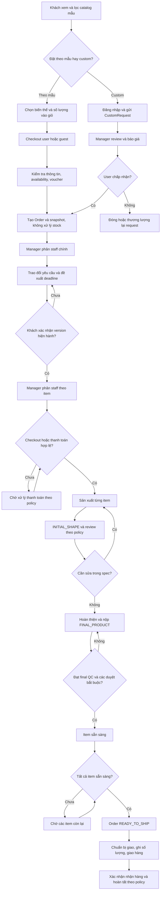
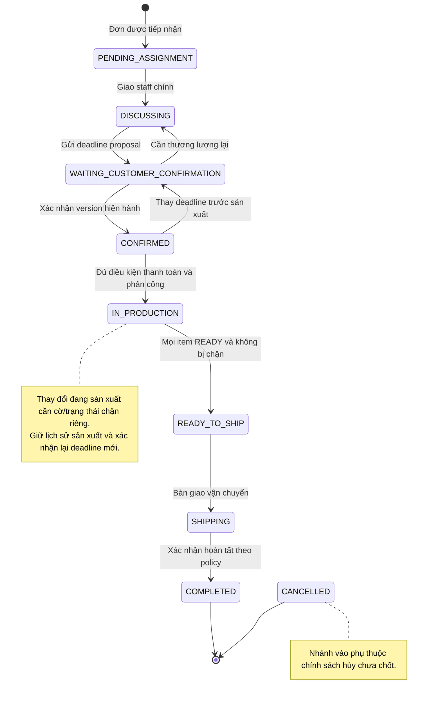
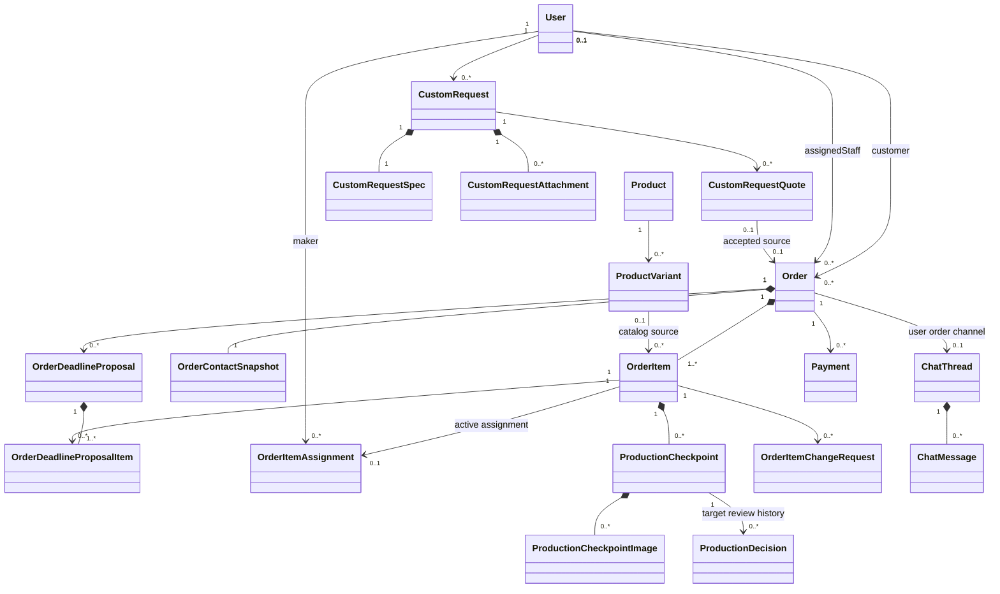
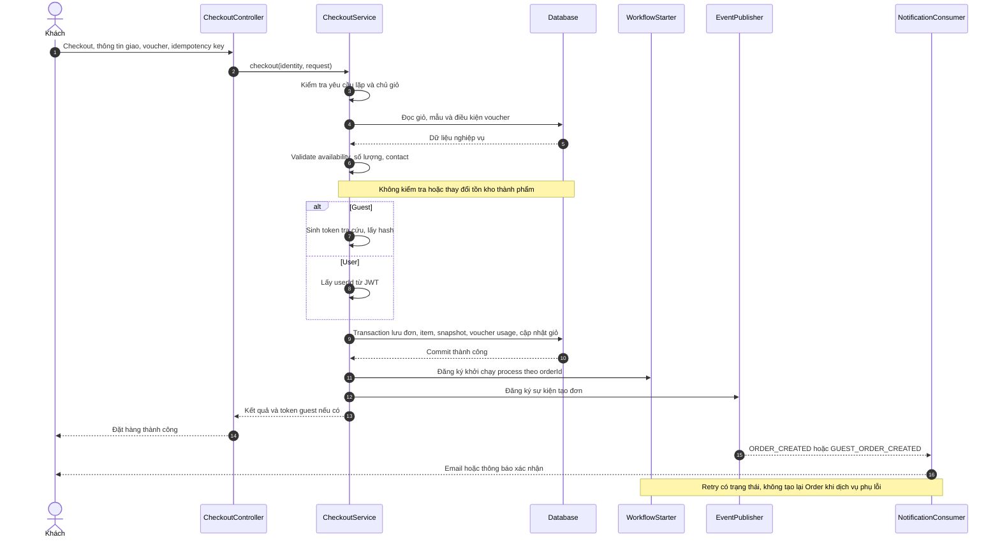
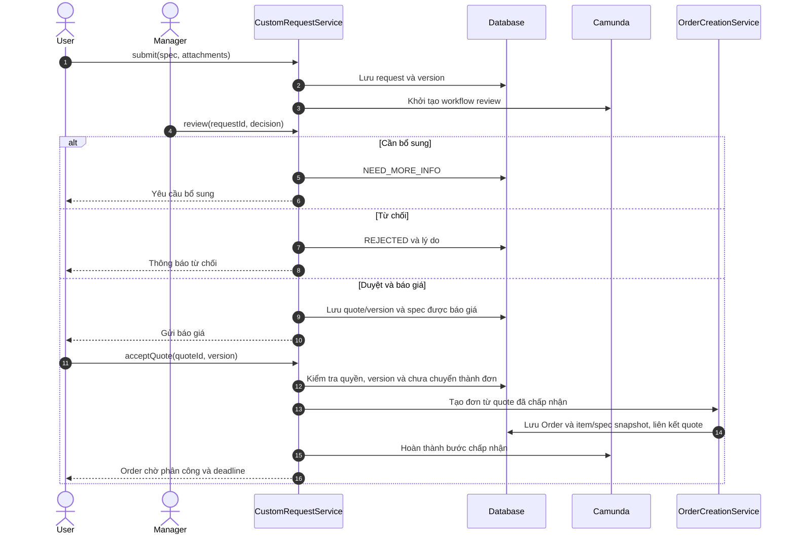
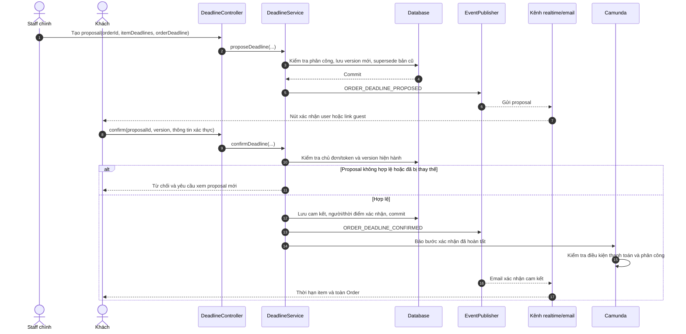
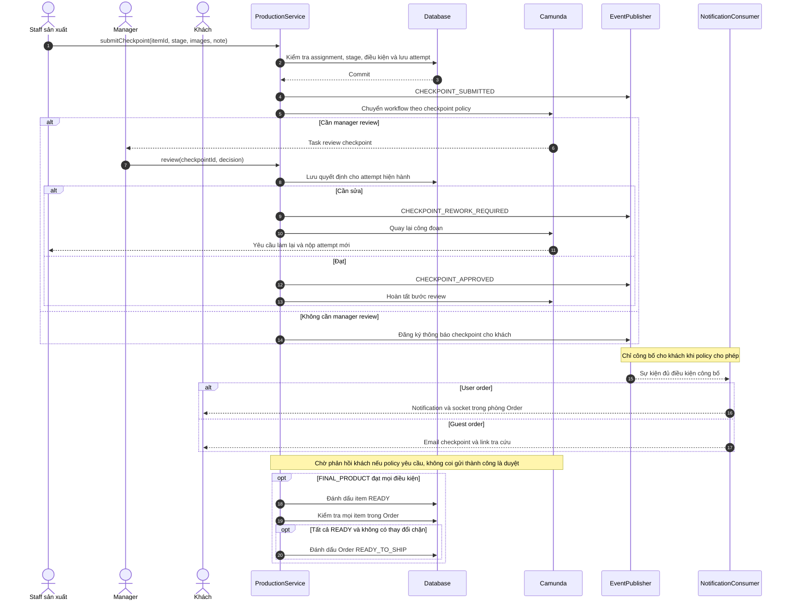
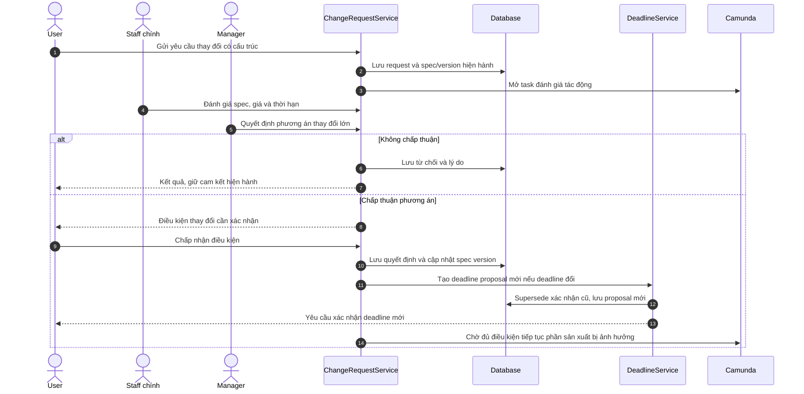
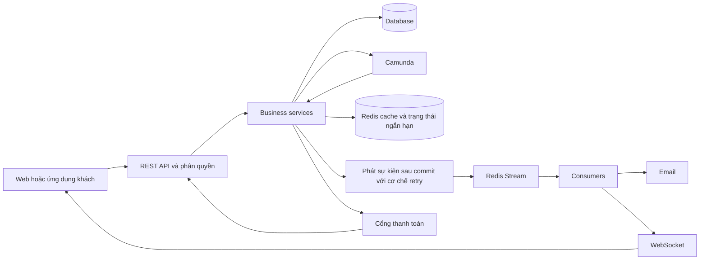

# BÁO CÁO PHÂN TÍCH HỆ THỐNG SHOP HANDMADE MADE-TO-ORDER

Ngày tổng hợp: 02/10/2026.

Mục đích: làm cơ sở xây dựng Use Case Diagram, đặc tả use case, Activity Diagram, BPMN, State Diagram, Class Diagram/ERD và Sequence Diagram.

## 1. Cơ sở và cách đọc tài liệu

Tài liệu tổng hợp [target.txt](target.txt), mô tả dự án trước đó và mã nguồn hiện tại, đặc biệt [OrderService.java](../src/main/java/com/example/workflow/service/OrderService.java), CartService, các controller đơn hàng và workflow BPMN.

**Quy tắc nghiệp vụ đã chốt trong target.txt được ưu tiên khi khác với code cũ.** Các sơ đồ trong báo cáo mô tả hệ thống mục tiêu (to-be), không khẳng định toàn bộ đã triển khai. Phần đối chiếu ở cuối mô tả hiện trạng qua đọc mã nguồn, chưa phải kết quả kiểm thử vận hành.

Ba loại thông tin được phân biệt:

- **Yêu cầu đã chốt:** nội dung được xác định trong target.txt.
- **Thiết kế đề xuất:** cách chuẩn hóa trạng thái, quan hệ, dịch vụ hoặc tương tác để vẽ sơ đồ nhất quán; tên lớp/API có thể điều chỉnh khi triển khai.
- **Chính sách cần chốt:** nội dung target.txt chưa quy định đủ; không coi hành vi code cũ là quyết định nghiệp vụ mới.

## 2. Mô tả tổng quan và phạm vi

### 2.1. Mô tả sử dụng trong báo cáo

Hệ thống là nền tảng bán sản phẩm handmade đa danh mục theo mô hình made-to-order. Các sản phẩm xuất hiện trên website chủ yếu là mẫu thiết kế do cửa hàng xây dựng. Hình ảnh thể hiện mẫu tham khảo; sản phẩm được chế tác sau khi có đơn và đủ điều kiện bắt đầu sản xuất. Giao diện phải thông báo rõ đặc điểm này.

Khách hàng có thể đặt sản phẩm theo mẫu của cửa hàng. Khách có tài khoản còn được gửi yêu cầu thiết kế riêng, trao đổi yêu cầu, nhận báo giá và xác nhận báo giá trước khi tạo đơn. Khách vãng lai được sử dụng giỏ hàng theo phiên, đặt hàng bằng thông tin liên hệ và theo dõi đơn qua liên kết bảo mật.

Mỗi đơn có một nhân viên chính do quản lý phân công. Người này là đầu mối trao đổi với khách và theo dõi tiến độ toàn đơn. Quản lý đồng thời phân công người trực tiếp sản xuất từng dòng sản phẩm trong đơn. Hai vai trò có thể do cùng một người đảm nhiệm nhưng được lưu và kiểm soát riêng.

Hệ thống tính thời gian sản xuất tham khảo theo mẫu và số lượng. Nhân viên chính lập đề xuất thời hạn có cấu trúc, khách xác nhận đề xuất để hình thành cam kết. Chỉ bắt đầu sản xuất khi đơn hợp lệ, điều kiện thanh toán/checkout được đáp ứng và phiên bản thời hạn hiện hành đã được xác nhận.

Quá trình sản xuất được quản lý theo từng dòng đơn với hai checkpoint chính: hình dáng ban đầu và sản phẩm hoàn thiện. Mỗi checkpoint có ảnh và có thể được nộp nhiều lần nếu cần sửa. Khách có tài khoản nhận cập nhật trong hệ thống; khách vãng lai nhận qua email. Việc duyệt, yêu cầu sửa và kiểm tra chất lượng cuối tuân theo chính sách áp dụng cho đơn.

Thay đổi lớn về yêu cầu, giá hoặc thời hạn phải được ghi nhận bằng yêu cầu thay đổi có cấu trúc. Tin nhắn chat chỉ phục vụ trao đổi; dữ liệu chính thức về thông số, báo giá, thời hạn và quyết định được lưu trong cơ sở dữ liệu.

Khi mọi dòng hàng đủ điều kiện giao, đơn được chuẩn bị giao hàng. Hệ thống tiếp tục theo dõi số lượng đặt, số lượng bàn giao và số lượng khách nhận để hỗ trợ đối soát, xác nhận hoàn tất và phản ánh chênh lệch.

### 2.2. Phạm vi chức năng

Trong phạm vi: catalog đa danh mục; tìm kiếm/lọc; tài khoản; giỏ hàng user/guest; checkout; voucher; custom request; báo giá; thanh toán theo chính sách; phân công; chat theo đơn; thỏa thuận thời hạn; sản xuất theo item; checkpoint/rework/final QC; change request; giao hàng và nhận hàng; email, thông báo và lịch sử nghiệp vụ.

Các chức năng cũ có thể kế thừa như wishlist, đánh giá sản phẩm, reputation, tư vấn trước bán và báo cáo hoa hồng được coi là phân hệ hỗ trợ. Không mặc định áp dụng cơ chế hoa hồng tư vấn cho phân công sản xuất; chính sách đó cần được xác định riêng.

Ngoài phạm vi hiện tại: tồn kho thành phẩm, giữ/trừ/hoàn tồn thành phẩm, quản lý nguyên vật liệu chi tiết, lập lịch tối ưu theo công suất xưởng, nhiều staff chính đồng thời trên một đơn. Tích hợp hãng vận chuyển, hoàn tiền tự động và giải quyết tranh chấp đầy đủ chưa được target.txt xác định.

## 3. Tác nhân và ranh giới hệ thống

| Tác nhân | Trách nhiệm/quyền nghiệp vụ |
|---|---|
| Khách vãng lai — Guest | Xem/lọc/tìm mẫu; quản lý giỏ theo phiên; dùng public voucher; checkout; tra cứu đơn và xác nhận deadline qua link bảo mật; nhận checkpoint bằng email |
| Khách có tài khoản — USER | Các chức năng mua theo mẫu; ví voucher và reputation; custom request; chấp nhận báo giá; chat theo đơn; xác nhận deadline; theo dõi/phản hồi checkpoint |
| Staff chính của đơn | Đầu mối khách hàng; trao đổi yêu cầu; lập đề xuất thời hạn; theo dõi tiến độ toàn đơn |
| Staff sản xuất item | Thực hiện item được giao; nộp ảnh/checkpoint; xử lý rework |
| Quản lý — MANAGER | Quản lý catalog; review custom và báo giá; phân công staff chính/item; duyệt thay đổi lớn; review checkpoint/final QC theo policy |
| Quản trị viên — ADMIN | Quản trị kỹ thuật và cấu hình theo phân quyền; không mặc nhiên thay thế vai trò quản lý nghiệp vụ |
| Cổng thanh toán | Xử lý giao dịch online, trả callback; MoMo là tích hợp hiện có |
| Dịch vụ email | Chuyển email xác nhận, deadline, checkpoint, liên kết bảo mật |
| Dịch vụ định danh | Xác thực tài khoản/token; Keycloak là nền tảng hiện có |

Staff chính và staff sản xuất là hai trách nhiệm nghiệp vụ của vai trò STAFF, không nhất thiết là hai loại tài khoản. Guest không phải một giá trị enum Role.

Trong Use Case Diagram toàn hệ thống, database, Redis và Camunda nằm trong ranh giới hệ thống. Trong Sequence Diagram kỹ thuật, có thể biểu diễn chúng bằng participant riêng.

**Quyền truy cập mục tiêu:** khách chỉ truy cập đơn của mình; guest chỉ truy cập đơn được token cho phép; staff chính chỉ thao tác đơn được giao; staff sản xuất chỉ thao tác item được giao. Theo target.txt, phòng chat Order dành cho khách sở hữu đơn, staff chính và manager. Staff sản xuất không tự động có quyền đọc chat nếu không đồng thời là staff chính.

## 4. Quy tắc nghiệp vụ chuẩn hóa

| Mã | Quy tắc |
|---|---|
| BR01 | Catalog mặc định là MADE_TO_ORDER; ảnh là ảnh mẫu, không thể hiện hàng có sẵn |
| BR02 | Chỉ mẫu ACCEPTING_ORDERS được thêm mới vào giỏ/checkout/reorder; PAUSED và DISCONTINUED không nhận đơn mới |
| BR03 | Không kiểm tra, giữ, trừ hay hoàn tồn kho thành phẩm ở giỏ, checkout, hủy đơn hoặc reorder |
| BR04 | Giữ CartItem.quantity, OrderItem.quantity, exportedQuantity, receivedQuantity và quota voucher |
| BR05 | Giỏ user gắn userId; giỏ guest gắn guestSessionId; định danh phiên giỏ không thay thế quyền truy cập đơn |
| BR06 | Guest checkout bắt buộc họ tên, email, điện thoại, địa chỉ; ghi chú tùy chọn |
| BR07 | Guest order có userId rỗng, contact snapshot và token tra cứu |
| BR08 | Chỉ user được tạo custom request; guest phải đăng nhập/đăng ký |
| BR09 | User dùng voucher cá nhân/reputation; guest chỉ dùng public/campaign voucher theo điều kiện |
| BR10 | Mỗi Order có một staff chính đang phụ trách; mỗi item có phân công sản xuất riêng |
| BR11 | Staff chính và staff sản xuất có thể là cùng người nhưng không đồng nhất hai quan hệ |
| BR12 | Thời gian tính tự động là tham khảo, không phải cam kết |
| BR13 | Deadline phải được đề xuất, lưu phiên bản và khách xác nhận có cấu trúc |
| BR14 | Thay deadline đã đề xuất/xác nhận làm xác nhận cũ mất hiệu lực; phải xác nhận phiên bản mới |
| BR15 | Sản xuất chỉ bắt đầu khi checkout/thanh toán hợp lệ và deadline hiện hành đã được xác nhận; item phải được phân công |
| BR16 | Sản xuất theo OrderItem, gồm INITIAL_SHAPE và FINAL_PRODUCT |
| BR17 | Mỗi stage có nhiều attempt; yêu cầu làm lại tạo vòng xử lý mới, giữ lịch sử cũ |
| BR18 | Review checkpoint theo policy; guest checkpoint đầu có thể tự gửi khi rủi ro thấp, final cần manager QC theo luồng mục tiêu |
| BR19 | User nhận checkpoint qua hệ thống/chat socket; guest qua email |
| BR20 | Thay đổi lớn về spec/giá/deadline phải tạo OrderItemChangeRequest, không chỉ sửa bằng chat |
| BR21 | Mọi item phải sẵn sàng mới đưa toàn Order sang READY_TO_SHIP; báo cáo dùng giao toàn đơn, không mặc định giao từng phần |
| BR22 | Database là nguồn dữ liệu chính; cache, event và chat không thay thế dữ liệu nghiệp vụ |

### 4.1. Thời gian sản xuất và deadline

Với q ≥ 1:

```text
itemEstimatedTime = productionTimeFirstUnit
                  + (q - 1) × productionTimeAdditionalUnit
                  + productionBufferDays
```

Ví dụ minh họa, không phải cấu hình bắt buộc: thời gian sản phẩm đầu 3 ngày, mỗi sản phẩm thêm 1 ngày, dự phòng 2 ngày; đặt 4 sản phẩm thì gợi ý là 8 ngày. Không áp dụng giảm 10% lũy tiến.

Không tự động lấy tổng hoặc giá trị lớn nhất của các item làm cam kết toàn đơn: các item có thể làm nối tiếp hoặc song song, còn công suất chi tiết chưa thuộc phạm vi. Staff đánh giá và đề xuất thời hạn từng item/toàn đơn. Đề xuất nên ghi rõ thời điểm hoàn thành sản xuất; không đồng nhất với thời điểm khách nhận hàng.

Thiết kế đề xuất: proposal lưu version, người đề xuất, các thời hạn item, thời hạn toàn đơn, trạng thái, người/thời điểm xác nhận. Snapshot thời hạn item có thể là bảng con OrderDeadlineProposalItem hoặc cấu trúc dữ liệu tương đương. Xác nhận cũ được đánh dấu hết hiệu lực, không xóa lịch sử.

### 4.2. Thanh toán và điều kiện bắt đầu

Giữ COD/online như khả năng của nền tảng hiện có, nhưng target.txt chưa chốt chính sách đặt cọc, thanh toán đủ, thời hạn trả tiền hoặc online cho guest.

Thiết kế dùng điều kiện trừu tượng `paymentOrCheckoutEligible`. Với COD được cửa hàng chấp nhận, điều kiện này có thể đúng dù chưa thu tiền; với online, chỉ đúng khi đáp ứng mức thanh toán được quy định. Không vẽ bắt buộc mọi khách thanh toán đủ trước sản xuất khi chưa có quyết định này.

```text
canStartItemProduction = orderAccepted
                     AND itemAssigned
                     AND currentDeadlineConfirmed
                     AND paymentOrCheckoutEligible
                     AND noBlockingChangeRequest
```

`noBlockingChangeRequest` là đề xuất thiết kế để tránh sản xuất theo yêu cầu đang tranh luận. Policy xác định thay đổi nào chặn item nào. Nếu đổi deadline khi đang sản xuất, cần giữ lịch sử tiến độ và đưa phần bị ảnh hưởng vào trạng thái chờ xử lý; không giả vờ quay lại trạng thái “chưa từng sản xuất”.

### 4.3. Checkpoint, review và thay đổi

Phân biệt ba hành động: staff nộp kết quả; manager kiểm tra theo policy; khách nhận/phản hồi. Gửi email hoặc khách đã xem ảnh không tự động là chấp thuận nghiệp vụ.

Một checkpoint lưu stage, attemptNumber, người nộp, thời gian, ghi chú và ảnh. Quyết định review phải có tác nhân và kết quả rõ ràng. Spec/giá/deadline thay đổi đi qua ChangeRequest; sửa để đạt spec đã chốt đi qua rework.

Điểm cần chốt: checkpoint nào cần khách duyệt bắt buộc, thời gian phản hồi, xử lý khi khách im lặng, quyền phản hồi của guest. Báo cáo không mặc định tự duyệt khi khách không phản hồi. Với user, final QC phụ thuộc policy; với guest, sơ đồ lấy manager final QC làm điều kiện trước gửi kết quả cuối/giao hàng theo luồng trong target.txt.

## 5. Danh mục use case và quan hệ UML

| Mã | Use case | Tác nhân chính |
|---|---|---|
| UC01 | Xem, tìm kiếm, lọc mẫu và xem chi tiết | Guest, USER |
| UC02 | Đăng ký, đăng nhập và quản lý tài khoản | Guest, USER |
| UC03 | Quản lý giỏ hàng | Guest, USER |
| UC04 | Đặt hàng theo mẫu | Guest, USER |
| UC05 | Sử dụng voucher phù hợp | Guest, USER |
| UC06 | Thanh toán trực tuyến và tiếp nhận kết quả | Khách đủ điều kiện, cổng thanh toán |
| UC07 | Gửi/bổ sung custom request | USER |
| UC08 | Review custom request và lập báo giá | MANAGER |
| UC09 | Chấp nhận/từ chối báo giá | USER |
| UC10 | Phân công/đổi staff chính của đơn | MANAGER |
| UC11 | Trao đổi trong phòng chat đơn | USER, staff chính, MANAGER |
| UC12 | Lập/điều chỉnh deadline proposal | Staff chính |
| UC13 | Xác nhận deadline hiện hành | USER, Guest qua link |
| UC14 | Phân công sản xuất từng item | MANAGER |
| UC15 | Bắt đầu sản xuất item | Staff sản xuất |
| UC16 | Nộp checkpoint và ảnh | Staff sản xuất |
| UC17 | Review checkpoint/final QC | MANAGER theo policy |
| UC18 | Xem/phản hồi checkpoint | USER; Guest nhận email, phản hồi theo policy cần chốt |
| UC19 | Thực hiện rework và nộp lại | Staff sản xuất |
| UC20 | Đề nghị/xử lý thay đổi spec, giá, deadline | USER, staff, MANAGER theo bước |
| UC21 | Tra cứu đơn và tiến độ | USER, Guest có token |
| UC22 | Chuẩn bị giao và ghi nhận số lượng giao | Staff được cấp quyền |
| UC23 | Xác nhận nhận hàng, phản ánh chênh lệch | USER; cơ chế Guest cần bổ sung policy |
| UC24 | Yêu cầu hủy đơn | Khách; điều kiện sau sản xuất cần chốt |
| UC25 | Đặt lại sản phẩm theo mẫu từ đơn cũ | USER |
| UC26 | Quản lý catalog/danh mục/cấu hình thời gian | MANAGER và quyền quản trị phù hợp |
| UC27 | Quản lý chiến dịch voucher | MANAGER và quyền quản trị phù hợp |
| UC28 | Xem thông báo, đánh giá và chức năng hỗ trợ | Theo phân quyền từng phân hệ |

Quan hệ đề xuất:

- UC04 include kiểm tra giỏ, kiểm tra khả năng nhận đơn, tính tiền, lưu đơn/snapshot. UC05 extend UC04 khi chọn voucher.
- Checkout user và checkout guest là hai biến thể của UC04; thanh toán online là luồng có điều kiện, không bắt buộc cho COD.
- UC09 chấp nhận báo giá bao gồm tạo đơn từ báo giá hợp lệ; không bắt buộc đi qua cart.
- UC13 include kiểm tra phiên bản proposal và quyền xác nhận.
- UC15 include kiểm tra điều kiện bắt đầu sản xuất.
- UC16 include lưu checkpoint/ảnh; review không phải bước bắt buộc cho mọi checkpoint mà do policy lựa chọn.
- UC20 là use case độc lập có thể khởi phát từ chat/checkpoint; không coi mọi tin nhắn là change request.
- Đăng nhập là tiền điều kiện của use case cần tài khoản, không cần include Đăng nhập ở mọi hình oval.

Use Case Diagram lõi bằng PlantUML, có thể sao chép vào công cụ hỗ trợ PlantUML. Sơ đồ này chọn các use case trọng tâm; dùng bảng trên để tách thêm sơ đồ catalog/tài khoản/voucher/giao hàng.



Việc sơ đồ online nối USER phản ánh phạm vi hiện có được kế thừa; nối thêm Guest khi chính sách thanh toán guest được xác định.

## 6. Đặc tả use case trọng tâm

### UC04 — Đặt hàng theo mẫu

**Mục tiêu:** tạo đơn từ mẫu catalog, không dựa trên tồn kho thành phẩm. **Tác nhân:** user/guest. **Tiền điều kiện:** giỏ có item hợp lệ, số lượng dương, mẫu còn nhận đơn.

1. Khách chọn các mục cần mua và xác nhận thông tin giao hàng.
2. Hệ thống xác định chủ giỏ bằng JWT hoặc guestSessionId.
3. Kiểm tra sản phẩm/biến thể, availability và số lượng; không kiểm tra stock.
4. Kiểm tra voucher đúng loại khách, thời hạn, điều kiện và quota.
5. Tính tổng tiền, chụp giá/spec/thông tin liên hệ cần thiết vào đơn.
6. Tạo Order và OrderItem; guest được cấp token tra cứu, database lưu bản băm token.
7. Ghi nhận sử dụng voucher và loại các mục đã checkout khỏi giỏ. Nếu checkout toàn giỏ thì giỏ trở thành rỗng.
8. Commit dữ liệu; khởi tạo luồng xử lý sau đặt hàng và gửi xác nhận bất đồng bộ.
9. Chuyển sang phân staff chính/thỏa thuận thời hạn; xử lý thanh toán theo phương thức đã chọn.

**Ngoại lệ:** giỏ rỗng; mẫu ngừng nhận đơn; dữ liệu liên hệ thiếu; voucher không hợp lệ; checkout trùng. Đề xuất idempotency trả lại kết quả của cùng yêu cầu hợp lệ thay vì tạo đơn mới; cùng key nhưng dữ liệu khác phải được phát hiện.

**Hậu điều kiện:** một đơn được lưu nhất quán; không có giữ/trừ stock. Email hoặc workflow lỗi phải có trạng thái retry/xử lý rõ, không làm người dùng vô tình đặt thêm đơn.

### UC07–UC09 — Custom request và báo giá

**Tác nhân:** USER, MANAGER. **Tiền điều kiện:** user đăng nhập.

1. User nhập chất liệu, màu, hình dáng, kích thước, số lượng, ghi chú và ảnh tham khảo.
2. Hệ thống lưu CustomRequest, spec và attachment; chuyển chờ review.
3. Manager từ chối, yêu cầu bổ sung, hoặc duyệt tính khả thi và lập báo giá.
4. Khi cần bổ sung, user cập nhật và gửi lại; giữ lịch sử các phiên bản.
5. User chấp nhận hoặc từ chối báo giá hiện hành.
6. Khi chấp nhận, hệ thống tạo đơn từ snapshot spec và giá đã chốt, liên kết về request/quote.
7. Đơn đi vào luồng phân công, thỏa thuận thời hạn và sản xuất chung.

**Ngoại lệ:** quote đã bị thay thế; request đóng; gửi chấp nhận lặp; thông tin chưa đủ. **Hậu điều kiện:** đơn phản ánh đúng quote được chấp nhận. Đề xuất một lần chấp nhận không tạo nhiều đơn.

Giá được chấp nhận không đồng nghĩa deadline đã được xác nhận. Đơn custom không bắt buộc phải có ProductVariant công khai; mô hình cần snapshot spec và nguồn custom riêng. Không tự đưa thiết kế riêng lên catalog công khai.

### UC10–UC14 — Phân công và thỏa thuận deadline

**Tác nhân:** MANAGER, staff chính, khách. **Tiền điều kiện:** đơn tồn tại và được tiếp nhận.

1. Manager phân một staff chính; hệ thống lưu người phân công và thời gian.
2. Với user, mở phòng chat theo Order và kiểm soát thành viên. Với guest, dùng email/liên kết bảo mật.
3. Staff xem yêu cầu, số lượng và thời gian tham khảo từng item.
4. Staff tạo proposal có thời hạn từng item và toàn đơn, kèm version.
5. Hệ thống gửi proposal bằng realtime cho user hoặc email cho guest.
6. Khách xác nhận đúng proposal hiện hành bằng nút chức năng/liên kết bảo mật.
7. Hệ thống lưu người, thời điểm, phiên bản cam kết và gửi email xác nhận.
8. Manager phân staff sản xuất từng item; hệ thống kiểm tra đủ điều kiện trước khi bắt đầu.

Phân item có thể thực hiện trước hoặc sau xác nhận deadline nhưng phải hoàn tất trước khi item bắt đầu. Chọn một thứ tự trên Activity Diagram không có nghĩa các bước độc lập luôn bị khóa cứng theo thứ tự đó.

**Ngoại lệ:** khách khác xác nhận; token hết hạn/sai mục đích; proposal cũ; thao tác xác nhận lặp; staff không được giao đơn. Proposal thay đổi phải tạo phiên bản mới và vô hiệu hóa xác nhận cũ.

**Hậu điều kiện:** deadline có bằng chứng xác nhận chính thức trong database. Tin nhắn “đồng ý” không đạt hậu điều kiện này.

### UC15–UC19 — Sản xuất, checkpoint và rework

**Tác nhân:** staff sản xuất, manager, khách theo policy. **Tiền điều kiện:** item được phân công, đơn đủ điều kiện checkout/thanh toán, deadline hiện hành đã xác nhận.

1. Staff bắt đầu item, lưu productionStartedAt.
2. Staff nộp INITIAL_SHAPE với ảnh, ghi chú và attempt.
3. Hệ thống lưu checkpoint và phát CHECKPOINT_SUBMITTED.
4. Nếu policy cần manager review, chờ quyết định; nếu không, gửi khách ngay.
5. Khi bị yêu cầu sửa trong phạm vi spec, staff làm lại và nộp attempt mới.
6. Nếu thay đổi spec/giá/deadline, tạo ChangeRequest và xử lý tác động trước khi tiếp tục phần liên quan.
7. Sau khi đạt điều kiện qua checkpoint đầu, staff hoàn thiện sản phẩm.
8. Staff nộp FINAL_PRODUCT; thực hiện final QC theo policy, guest có manager final QC.
9. Khi đạt các điều kiện duyệt/phản hồi bắt buộc, item sẵn sàng giao.
10. Hệ thống kiểm tra mọi item; chỉ khi tất cả sẵn sàng mới đánh dấu toàn Order READY_TO_SHIP.

**Ngoại lệ:** sai staff, sai stage, thiếu ảnh, duyệt attempt cũ, quyết định lặp, proposal hết hiệu lực. **Hậu điều kiện:** tiến độ, ảnh và quyết định có lịch sử; không mất attempt cũ.

### UC20 — Thay đổi yêu cầu trong quá trình xử lý

**Tác nhân:** khách/staff khởi tạo theo quyền, manager duyệt thay đổi lớn. **Tiền điều kiện:** xác định item và spec/quote/deadline hiện hành.

1. Từ trao đổi hoặc checkpoint, tạo ChangeRequest nêu nội dung cũ/mới và lý do.
2. Staff đánh giá ảnh hưởng spec, giá, thời hạn và phần công việc đã làm.
3. Manager xem xét thay đổi lớn và lập phương án chấp thuận/từ chối.
4. Khách xác nhận điều kiện thay đổi theo policy; chỉ thông báo chat không thay thế quyết định này.
5. Khi được chấp nhận, cập nhật snapshot/phiên bản áp dụng; nếu deadline thay đổi thì tạo proposal mới để khách xác nhận lại.
6. Kiểm tra thanh toán bổ sung nếu có và điều kiện tiếp tục sản xuất.

**Hậu điều kiện:** thay đổi có nguồn gốc, người duyệt và lịch sử. Thứ tự chi tiết manager/khách xác nhận và thu phần giá chênh lệch là thiết kế cần hoàn thiện; không tự giả định đã có trong code.

### UC21 — Tra cứu đơn

User truy cập bằng tài khoản và được kiểm tra quyền sở hữu. Guest truy cập bằng token gắn với đơn; không dùng orderId đơn thuần hoặc guestSessionId làm bằng chứng quyền đọc. Kết quả gồm snapshot đơn, staff phụ trách, deadline, tiến độ item và checkpoint được phép công bố.

Thiết kế bảo mật đề xuất: token tra cứu chỉ có quyền đọc; xác nhận deadline dùng token có mục đích và phiên bản cụ thể hoặc cơ chế ủy quyền tương đương. Thời hạn token, cấp lại và thu hồi cần xác định khi triển khai.

### UC22–UC25 — Giao hàng và sau bán

Kế thừa ý nghĩa đối soát của code cũ: quantity là số lượng đặt; exportedQuantity là số lượng chuẩn bị/bàn giao giao hàng; receivedQuantity là số lượng thực nhận. Các số này không phải stock thành phẩm.

Thiết kế đề xuất: đơn READY_TO_SHIP được chuẩn bị giao, lưu số lượng bàn giao và chuyển SHIPPING. Khách xác nhận nhận hàng; nếu lệch thì hiển thị chênh lệch và cho phép phản ánh theo policy. Phân biệt final QC sản phẩm với kiểm tra số lượng trước giao.

User hiện có luồng nhận hàng/khiếu nại trong code. Cách guest xác nhận nhận hàng, ai được kết thúc đơn nếu khách không phản hồi, xử lý hoàn tiền/bồi thường cần chốt riêng. Không vẽ email checkpoint như sự kiện tự động hoàn tất đơn.

Hủy đơn không còn hoàn stock. Điều kiện hủy trước/sau bắt đầu sản xuất và hoàn tiền là chính sách cần chốt; không tự áp dụng toàn bộ mức phạt reputation cũ vào mô hình mới. Reorder theo mẫu thêm lại các mục còn nhận đơn vào giỏ, dùng giá/điều kiện hiện hành; không tự chấp nhận lại giá hoặc deadline cũ. Custom reorder cần policy báo giá lại.

## 7. Activity Diagram và hướng dẫn BPMN

### 7.1. Luồng tổng thể mục tiêu



Sơ đồ trên thể hiện happy path và rework cơ bản. ChangeRequest phải được vẽ thành subprocess riêng có thể phát sinh từ trao đổi hoặc checkpoint. Nhánh thiếu dữ liệu custom quay về bổ sung request; từ chối không tạo Order.

### 7.2. Cấu trúc BPMN đề xuất

Pool khách và pool cửa hàng; phía cửa hàng có lane backend tự động, manager, staff chính, staff sản xuất. Email/cổng thanh toán là participant ngoài hệ thống khi cần biểu diễn giao tiếp. User và guest là hai kênh tương tác, không phải hai quy trình sản xuất hoàn toàn khác nhau.

- Checkout và tạo dữ liệu ban đầu xử lý đồng bộ trong transaction database.
- Sau commit, bắt đầu process xử lý Order; có trạng thái start/retry nếu Camunda lỗi.
- User task: phân staff chính, đề xuất/xác nhận deadline, phân item, review, xử lý thay đổi.
- Chờ khách/thanh toán bằng user task hoặc message catch phù hợp với cách tích hợp.
- Subprocess/call activity sản xuất nhiều instance theo OrderItem; không tạo một production task duy nhất cho toàn đơn nhiều item.
- Gateway chọn review policy; vòng lặp rework giữ stage và tăng attempt.
- Điểm hợp nhất chờ mọi item sẵn sàng trước giao toàn đơn.
- Chỉ thêm timer hủy/tự duyệt khi có chính sách thời hạn cụ thể; không sao chép timeout 15 phút của workflow cũ thành mọi loại timeout mới.

## 8. Mô hình trạng thái đề xuất

Không dồn thanh toán, thỏa thuận, sản xuất và giao hàng vào một enum. Các tên sau phục vụ thiết kế mục tiêu, chưa phải enum có sẵn đầy đủ.

| Trục | Trạng thái gợi ý | Ý nghĩa |
|---|---|---|
| Xử lý Order | PENDING_ASSIGNMENT, DISCUSSING, WAITING_CUSTOMER_CONFIRMATION, CONFIRMED, IN_PRODUCTION, READY_TO_SHIP, SHIPPING, COMPLETED, CANCELLED | Vòng đời tổng thể |
| Deadline proposal | PROPOSED, CONFIRMED, SUPERSEDED; REJECTED nếu có chức năng từ chối | Phiên bản cam kết |
| Thanh toán | PENDING, PAID, FAILED; COD được biểu diễn bằng phương thức và điều kiện chấp nhận | Không đồng nhất COD hợp lệ với đã thu tiền |
| Item production | WAITING_ASSIGNMENT, ASSIGNED, INITIAL_IN_PROGRESS, INITIAL_WAITING_REVIEW, INITIAL_REWORK_REQUIRED, FINAL_IN_PROGRESS, FINAL_WAITING_QC, FINAL_REWORK_REQUIRED, READY | Có thể kế thừa nhiều enum hiện có |
| Custom request | SUBMITTED, NEED_MORE_INFO, REJECTED, QUOTED, ACCEPTED, CLOSED | Cần tách lịch sử quote version |
| Change request | SUBMITTED, UNDER_REVIEW, WAITING_CUSTOMER_ACCEPTANCE, APPROVED, REJECTED, APPLIED | Tên và thứ tự chi tiết là đề xuất |

`CONFIRMED` trên trục Order có nghĩa deadline đã được xác nhận, chưa chắc thanh toán đủ điều kiện. Item `READY` tương ứng ngữ nghĩa READY_TO_SHIP ở cấp item; tránh dùng hai tên như hai bước khác nhau. Nếu giữ `DELIVERED` hiện có thay `COMPLETED`, phải thống nhất một tên trong thiết kế và mã nguồn.



## 9. Mô hình dữ liệu và Class Diagram

| Thực thể/khái niệm | Dữ liệu và trách nhiệm chính |
|---|---|
| Category | Cây danh mục; cấu trúc mới cần bổ sung/đối chiếu khi triển khai |
| Product / ProductVariant | Mẫu/biến thể, thuộc tính lọc, ảnh mẫu, availability, cấu hình thời gian; không dùng quantity làm tồn thành phẩm |
| GuestSession | Phiên giỏ guest, thời hạn hoạt động; Redis quản lý TTL, database lưu liên kết cần thiết theo thiết kế |
| Cart / CartItem | Chủ giỏ user hoặc guest; biến thể và số lượng |
| Order | Chủ đơn nullable, staff chính, người phân công, thời điểm phân công, trạng thái, tổng tiền và deadline hiện hành |
| OrderContactSnapshot | Họ tên, email, điện thoại, địa chỉ, ghi chú tại thời điểm đặt; có thể nhúng vào Order |
| OrderLookupToken | Bản băm token/quyền tra cứu; có thể là trường trong Order thay vì bảng riêng |
| OrderItem | Số lượng, giá và spec snapshot, nguồn catalog/custom, trạng thái sản xuất, số lượng giao/nhận |
| OrderDeadlineProposal | Version, thời hạn toàn đơn, người đề xuất, quyết định xác nhận và thời điểm |
| OrderDeadlineProposalItem | Đề xuất bảng con lưu thời hạn từng item theo version; tránh chỉ sửa trực tiếp deadline item và mất lịch sử |
| OrderItemAssignment | Staff sản xuất và manager phân công, thời gian; giữ lịch sử phân công nếu cần |
| ProductionCheckpoint | Item, stage, attempt, ảnh, ghi chú, trạng thái, người nộp |
| ProductionCheckpointImage | Ảnh minh chứng của checkpoint |
| ProductionDecision | Quyết định review; kế thừa entity hiện có, mở rộng nếu cần nhiều người duyệt |
| CustomRequest / Spec / Attachment | Yêu cầu riêng và dữ liệu thiết kế/ảnh tham khảo |
| CustomRequestQuote | Báo giá theo phiên bản, spec liên quan, người lập và kết quả chấp nhận |
| OrderItemChangeRequest | Nội dung thay đổi và tác động giá/deadline, các quyết định |
| Payment | Khái niệm mục tiêu lưu giao dịch và kết quả; hiện cần bổ sung mô hình rõ |
| VoucherTemplate / UserVoucher / PublicVoucherUsage | Chính sách, quyền sở hữu và lịch sử sử dụng; guest chống lạm dụng theo email/phone hash/session theo rule |
| ChatThread / ChatMessage | Phòng theo Order hoặc consultation; tin nhắn không thay dữ liệu thỏa thuận |
| Notification / Audit history | Lịch sử cập nhật, người nhận, người thực hiện và thời gian |

Class Diagram dưới đây là mô hình khái niệm mục tiêu, không phải sơ đồ bảng JPA hiện tại. Bội số một assignment hiện hành không cấm lưu nhiều bản ghi lịch sử.



Quan hệ quote–order giả định mỗi quote được chấp nhận tạo tối đa một đơn; nếu muốn gộp nhiều custom request hoặc trộn custom/catalog trong một checkout, cần mở rộng mô hình. Quan hệ checkpoint–decision nhiều bản ghi là đề xuất cho lịch sử nhiều quyết định; entity hiện tại là one-to-one. Không đồng nhất hình này với ERD hiện có.

## 10. Sequence Diagram mục tiêu

Các participant như CheckoutService, DeadlineService, ProductionService, CustomRequestService là tên trách nhiệm đề xuất. Code hiện tại có thể còn đặt trách nhiệm trong CartService/OrderService.

### SD01 — Checkout user/guest



Đề xuất chỉ định một nơi chịu trách nhiệm phát sự kiện tạo đơn. Nếu giữ Camunda phát GUEST_ORDER_CREATED như hiện tại thì WorkflowStarter/process phát sự kiện đó; không đồng thời phát thêm ở CheckoutService. Cần thiết kế outbox hoặc cơ chế retry tương đương nếu yêu cầu không mất event giữa commit và publish; báo cáo không coi publish-after-commit tự nó bảo đảm điều này.

### SD02 — Custom request đến Order



Nhánh user từ chối báo giá đóng hoặc thương lượng lại request, không tạo đơn. Việc chấp nhận quote và liên kết Order cần transaction/idempotency để tránh hai đơn khi nhấn lặp.

### SD03 — Đề xuất và xác nhận deadline



Đề xuất bảo vệ version bằng khóa cập nhật/optimistic locking. Xác nhận lặp cùng version trả kết quả hiện có và không tạo event nghiệp vụ mới. Email consumer cần chống xử lý trùng; không tuyên bố hạ tầng email tự có bảo đảm exactly-once.

### SD04 — Checkpoint, review và rework



Khi hai item cuối hoàn tất đồng thời, cập nhật tổng hợp Order phải kiểm tra lại dữ liệu nhất quán và chống phát trùng sự kiện sẵn sàng giao.

### SD05 — ChangeRequest làm thay đổi deadline



Đây là trình tự đề xuất cho thay đổi lớn, cần chốt thêm quy trình thu tiền chênh lệch và quyền khởi tạo của staff/guest. Guest không có chat Order hoặc custom request công khai trong phạm vi đã chốt; staff có thể cần cơ chế ghi nhận trao đổi qua email, nhưng chưa coi đó là chức năng đã xác định đầy đủ.

## 11. Kiến trúc và phân công trách nhiệm công nghệ

| Thành phần | Trách nhiệm mục tiêu | Không dùng để thay thế |
|---|---|---|
| Database | Catalog, cart, order, spec/price snapshot, payment, voucher usage, assignment, proposal/version, checkpoint, change request | — |
| Redis Cache/các cấu trúc Redis ngắn hạn | Category tree, listing/filter/search/detail, bestseller, voucher public, guest TTL, rate limit, idempotency, presence | Dữ liệu cam kết chính thức và lịch sử nghiệp vụ |
| Redis Stream | Sự kiện và tác vụ bất đồng bộ, email, notification, cập nhật thống kê/audit phụ trợ | State machine nghiệp vụ chính |
| Camunda | Quy trình dài ngày, user task, chờ xác nhận, phân công, checkpoint/rework, QC, change request | Transaction tạo dữ liệu giỏ/đơn bắt buộc phải nhất quán |
| WebSocket | Giao tiếp realtime và thông báo theo quyền của phòng Order | Bằng chứng duy nhất của deadline/spec được chấp thuận |
| Email | Kênh cập nhật guest và gửi xác nhận chính thức | Dữ liệu trạng thái chính hoặc quyền truy cập chỉ dựa vào orderId |

Sự kiện mục tiêu: ORDER_CREATED, GUEST_ORDER_CREATED, CUSTOM_REQUEST_SUBMITTED, CUSTOM_REQUEST_APPROVED, ORDER_STAFF_ASSIGNED, STAFF_ASSIGNED, ORDER_DEADLINE_PROPOSED, ORDER_DEADLINE_CONFIRMED, PRODUCTION_STARTED, CHECKPOINT_SUBMITTED, CHECKPOINT_APPROVED, CHECKPOINT_REWORK_REQUIRED, EMAIL_REQUESTED, NOTIFICATION_REQUESTED.

Đề xuất đặt `STAFF_ASSIGNED` thành tên rõ cấp item, hoặc dùng payload chứa assignmentType. Event nên có eventId, aggregateId, version và thời gian; consumer kiểm tra idempotency. Không gửi dữ liệu checkpoint đang chờ duyệt cho khách chỉ vì consumer nhìn thấy CHECKPOINT_SUBMITTED.



## 12. Đối chiếu mã nguồn và hướng cập nhật

| Nội dung | Hiện trạng qua đọc code | Hệ thống mục tiêu |
|---|---|---|
| Trọng tâm đơn hàng | OrderService còn luồng duyệt–kho–KCS–nhận hàng | Điều phối phân công–deadline–sản xuất từng item–QC–giao |
| Tồn thành phẩm | Còn InventoryReservationService, nhánh hoàn tồn khi hủy/payment fail, delegate tồn kho | Loại bỏ khỏi luồng made-to-order; không xóa quantity đơn/voucher |
| Availability | CartService đã kiểm tra ACCEPTING_ORDERS | Dùng thống nhất cho thêm giỏ, checkout, reorder và quản lý catalog |
| Guest | Có giỏ guest, contact snapshot, token hash, checkout và workflow sau tạo đơn | Hoàn thiện tra cứu, xác nhận deadline và checkpoint qua email |
| Staff cấp đơn | Hiện dùng warehouseStaff với ý nghĩa phụ trách kho | assignedStaff là đầu mối toàn đơn; không đổi tên mà bỏ qua thay đổi trách nhiệm |
| Staff cấp item | Có entity OrderItemAssignment | Hoàn thiện API, quyền và workflow phân công/sản xuất |
| Deadline | Chưa thấy bộ entity/service/controller proposal đầy đủ | Thêm proposal version, xác nhận user/guest và điều kiện chặn sản xuất |
| Custom | Chưa thấy phân hệ CustomRequest đầy đủ | Thêm request/spec/attachment/quote và chuyển quote thành Order |
| Chat | Có chat và consultation | Bổ sung phòng theo Order, membership theo phân công |
| Checkpoint | Có entity/enum/repository, dữ liệu ảnh và decision | Hoàn thiện submit/review/rework/policy/notification và tổng hợp READY |
| Guest BPMN runtime | Có publish event, manager review và task phân handmade item | Bổ sung staff chính, deadline, production multi-instance và final QC |
| Duyệt hiện tại | processAdminReview đang comment tìm task và complete task | Khi triển khai, đồng bộ transaction nghiệp vụ và bước workflow; không xem code tạm là thiết kế đích |
| Giao và nhận | Có exportedQuantity, receivedQuantity, xác nhận và phản ánh user | Giữ đối soát số lượng, bỏ ý nghĩa trừ tồn; chốt thêm cơ chế guest |
| Payment/hủy/reputation | Có MoMo, rule uy tín và hủy trước duyệt của mô hình cũ | Rà lại cho đơn đã cam kết/sản xuất; không mặc định kế thừa tiền phạt/hoàn tiền |

Các phase trong target.txt là kế hoạch triển khai theo giai đoạn, không phải một sơ đồ nghiệp vụ cuối cùng. Vì vậy báo cáo mục tiêu loại bỏ tồn kho ngay từ định nghĩa hệ thống, dù việc xóa code inventory nằm ở phase muộn hơn.

### 12.1. Định hướng tách trách nhiệm service

Đề xuất giữ OrderService quản lý thông tin/vòng đời chung; tách CheckoutService, OrderAssignmentService, DeadlineService, ProductionService, CustomRequestService, ChangeRequestService và PaymentService theo trách nhiệm. Đây là đề xuất phục vụ thiết kế lớp/sequence, không phải yêu cầu bắt buộc tách ngay toàn bộ code.

### 12.2. Các chính sách chưa đủ dữ liệu để kết luận

1. COD/online áp dụng cho guest và custom thế nào; đặt cọc hay thanh toán đủ; thời hạn thanh toán.
2. Hủy đơn trước/sau chốt deadline hoặc bắt đầu sản xuất; chi phí đã làm, hoàn tiền và reputation.
3. Quyền khách duyệt checkpoint, cách guest phản hồi, timeout phản hồi và phân loại rủi ro.
4. Cách xử lý khi đổi deadline sau khi sản xuất đã bắt đầu: dừng item nào, ai được cho tiếp tục.
5. Chính sách đổi staff chính; có cần xác nhận lại deadline nếu chỉ đổi người nhưng giữ cam kết không.
6. Cơ chế xác nhận giao hàng/hoàn tất cho guest, phản ánh thiếu hàng và xử lý bồi hoàn.
7. Quote hết hạn, nhiều vòng báo giá, reorder custom và trộn catalog/custom trong cùng đơn.
8. Thời gian tính theo ngày lịch/ngày làm việc; múi giờ và khoảng vận chuyển sau hoàn thành sản xuất.
9. Phạm vi kế thừa thưởng uy tín, đánh giá và hoa hồng từ hệ thống cũ.

Các mục này không cản trở vẽ happy path. Hãy đặt điều kiện `theo policy` hoặc note bên cạnh nhánh tương ứng, không tự điền quy tắc như thể đã chốt.

## 13. Bộ sơ đồ và kịch bản kiểm chứng nên đưa vào báo cáo

### 13.1. Bộ sơ đồ

1. Use Case tổng quan theo tác nhân; tách thêm catalog/checkout, custom và production nếu hình quá lớn.
2. Activity tổng thể; Activity custom; Activity deadline; Activity checkpoint/rework.
3. BPMN xử lý Order và subprocess production nhiều instance theo item.
4. State Diagram Order; ItemProduction; DeadlineProposal; CustomRequest/Quote; ChangeRequest.
5. Class Diagram miền nghiệp vụ; ERD riêng phản ánh cách triển khai bảng/embedded thực tế.
6. Sequence checkout user/guest, custom/quote, deadline, checkpoint và change request như phần 10.
7. Sequence payment callback, giao/nhận và hủy sau khi chốt các chính sách còn thiếu.
8. Component Diagram cho database, Camunda, Redis, WebSocket, email và cổng thanh toán.

### 13.2. Kịch bản kiểm chứng tính nhất quán thiết kế

| Kịch bản | Kết quả mong đợi của thiết kế mục tiêu |
|---|---|
| Guest mua mẫu ACCEPTING_ORDERS với số lượng hợp lệ | Tạo đơn không phụ thuộc stock thành phẩm |
| Mẫu bị PAUSED sau khi thêm giỏ | Checkout từ chối nhận đơn mới cho mẫu đó |
| Nhấn checkout hai lần cùng yêu cầu/idempotency key | Không tạo hai đơn |
| Guest yêu cầu custom | Được yêu cầu đăng nhập/tạo tài khoản |
| User nhấn chấp nhận quote lặp | Tối đa một Order cho lần chấp nhận |
| Chưa có deadline xác nhận | Không bắt đầu sản xuất |
| Xác nhận proposal đã bị thay thế | Bị từ chối; phải xem version mới |
| Deadline đã xác nhận nhưng điều kiện payment chưa đạt | Tiếp tục chờ, không sản xuất |
| Staff không phụ trách đọc chat đơn | Bị từ chối theo membership |
| Staff làm item nhưng không phải staff chính | Không tự có quyền chat Order |
| Checkpoint bị rework | Giữ attempt cũ và tạo attempt mới khi nộp lại |
| Guest final chưa qua manager QC | Chưa công bố final/giao hàng theo luồng đã chọn |
| Một trong nhiều item chưa READY | Toàn đơn chưa READY_TO_SHIP |
| Chat đề nghị đổi kích thước/giá/deadline | Phải tạo ChangeRequest trước khi cập nhật cam kết |
| Hủy đơn mục tiêu | Không gọi hoàn stock thành phẩm |
| Email hoặc workflow lỗi sau checkout commit | Đơn vẫn truy xuất được; có trạng thái retry/xử lý rõ |

## 14. Nguồn đối chiếu chính

- [target.txt](target.txt): ý tưởng và các quy tắc mục tiêu, nguồn ưu tiên của báo cáo.
- [OrderService.java](../src/main/java/com/example/workflow/service/OrderService.java): đơn hàng, phân công kho cũ, KCS, nhận hàng, hủy, reorder, callback.
- [CartService.java](../src/main/java/com/example/workflow/service/CartService.java): giỏ, checkout thành viên/guest và availability.
- [Order.java](../src/main/java/com/example/workflow/entity/Order.java), [OrderItem.java](../src/main/java/com/example/workflow/entity/OrderItem.java): dữ liệu đơn, snapshot, quantity và trạng thái sản xuất.
- [ProductionCheckpoint.java](../src/main/java/com/example/workflow/entity/ProductionCheckpoint.java), [ProductionDecision.java](../src/main/java/com/example/workflow/entity/ProductionDecision.java): nền tảng dữ liệu checkpoint và review.
- [guest-purchase-runtime.bpmn](../src/main/resources/guest-purchase-runtime.bpmn), [approve-cart.bpmn](../src/main/resources/approve-cart.bpmn): workflow hiện tại để đối chiếu khoảng cách với thiết kế mục tiêu.

Báo cáo chỉ bổ sung tài liệu phân tích; không thực hiện thay đổi mã nguồn ứng dụng.
