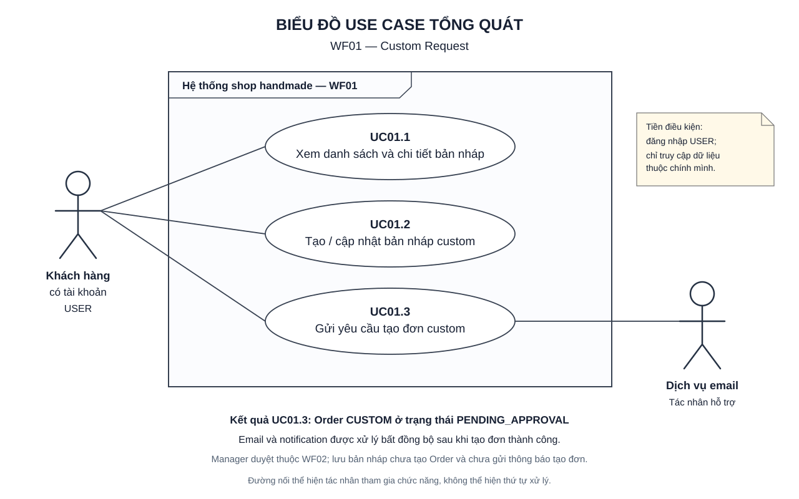

# WF01 — Custom Request

Luồng quản lý bản nháp và gửi yêu cầu tạo đơn custom. Đầu ra gửi thành công là Order CUSTOM ở PENDING_APPROVAL; manager duyệt trong workflow tiếp theo.

Nguồn: [target.txt](../../target.txt). Quy cách tài liệu: [TUTORIAL.md](../TUTORIAL.md).

| File | Nội dung |
|---|---|
| [usecase.md](usecase.md) | Đặc tả UC01.1, UC01.2, UC01.3, quy tắc và nghiệm thu |
| [diagram.md](diagram.md) | Sơ đồ hoạt động riêng từng UC và luồng tổng thể |
| [sequence.md](sequence.md) | Biểu đồ tuần tự riêng từng UC |
| [overview.svg](overview.svg) | Hình Use Case tổng quan: actor hình người và chức năng oval |
| [overview.puml](overview.puml) | Mã nguồn UML để chỉnh sửa sơ đồ tổng quan |

Mở overview.svg bằng Chrome/Edge để xem trực tiếp. Xem diagram.md và sequence.md ở chế độ Markdown preview hỗ trợ Mermaid.
