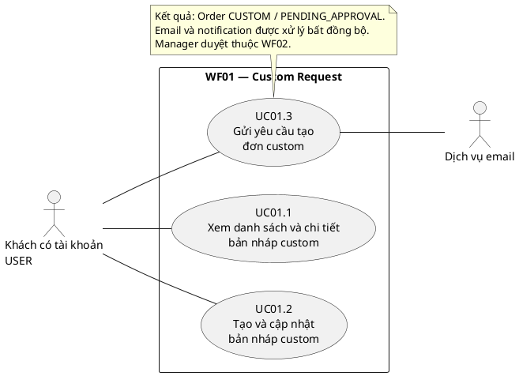
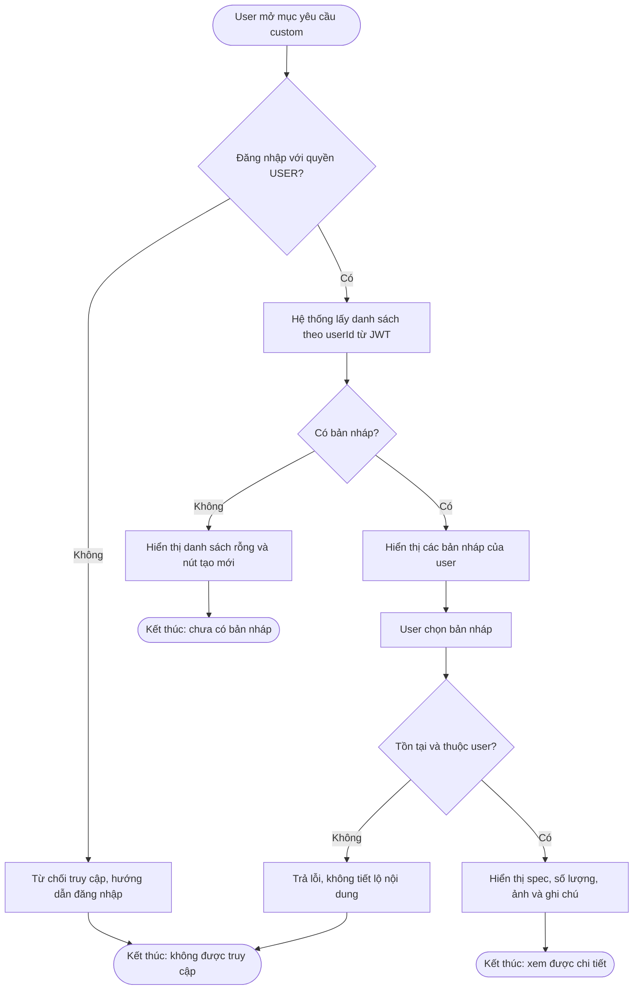
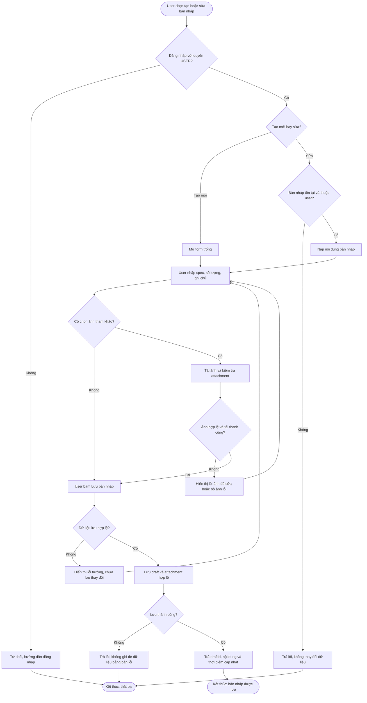
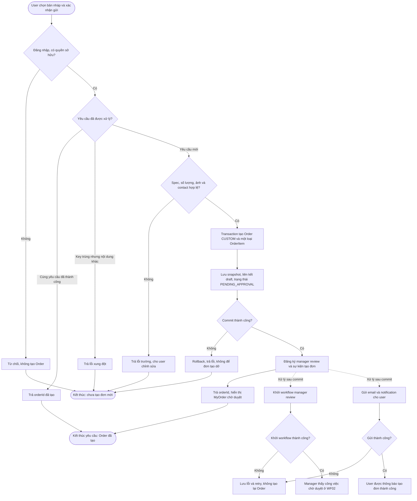
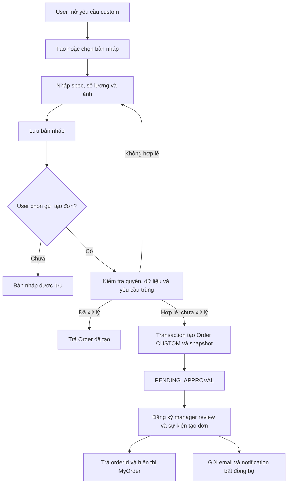

# WF01 — Sơ đồ tổng quan và hoạt động

### 9.1. Use Case Diagram tổng quan WF01

Tệp hình vector để chèn báo cáo: [WF01-use-case-overview.svg](overview.svg). Mã nguồn chỉnh sửa bằng PlantUML: [WF01-use-case-overview.puml](overview.puml).

Sơ đồ UML bằng PlantUML. Ba use case là các mục tiêu độc lập của USER; không dùng include/extend để biểu diễn thứ tự thao tác. Đăng nhập là tiền điều kiện. Dịch vụ email là actor phụ bên ngoài; backend, database và Camunda nằm trong hệ thống.

Các sơ đồ Mermaid dưới đây là sơ đồ hoạt động tổng quát, thể hiện xử lý và kết quả của từng UC; không phải ký pháp UML Use Case Diagram.

### 9.2. UC01.1 — Xem danh sách và chi tiết bản nháp

Điểm chuyển tiếp: từ danh sách/chi tiết, user có thể chọn UC01.2 hoặc UC01.3. Việc xem không làm thay đổi draft, không tạo Order và không gửi email.

### 9.3. UC01.2 — Tạo/cập nhật bản nháp

Kết quả chỉ là bản nháp. Không có Order, email tạo đơn, thanh toán hoặc task manager. Validation cho phép thiếu trường nào khi lưu nháp phải theo schema đã được chốt, không mặc định giống validation gửi đơn.

### 9.4. UC01.3 — Gửi bản nháp tạo Order custom

Các cạnh nét đứt là phần xử lý bất đồng bộ sau commit, không yêu cầu API chờ email hoặc workflow chạy xong. Hai yêu cầu gửi đồng thời vẫn phải được bảo vệ bằng transaction/idempotency tại server, không chỉ bằng bước kiểm tra trước khi lưu.

Kết quả nghiệp vụ: một Order CUSTOM ở PENDING_APPROVAL; chưa manager duyệt, chưa chốt giá, chưa thanh toán, chưa tạo chat/phân công và chưa chạy timer custom 24 giờ. Timer bắt đầu sau quyết định manager ở workflow tiếp theo.

### 9.5. Activity liên kết ba use case

Use Case Diagram: USER liên kết với UC01.1, UC01.2 và UC01.3. Manager liên kết use case duyệt ở WF02, không phải người thao tác tạo yêu cầu. Không dùng quan hệ include giữa lưu nháp và gửi đơn chỉ để biểu diễn thứ tự; bản nháp có thể được lưu mà không gửi.

Biểu đồ tuần tự chi tiết nằm trong [sequence.md](sequence.md).
