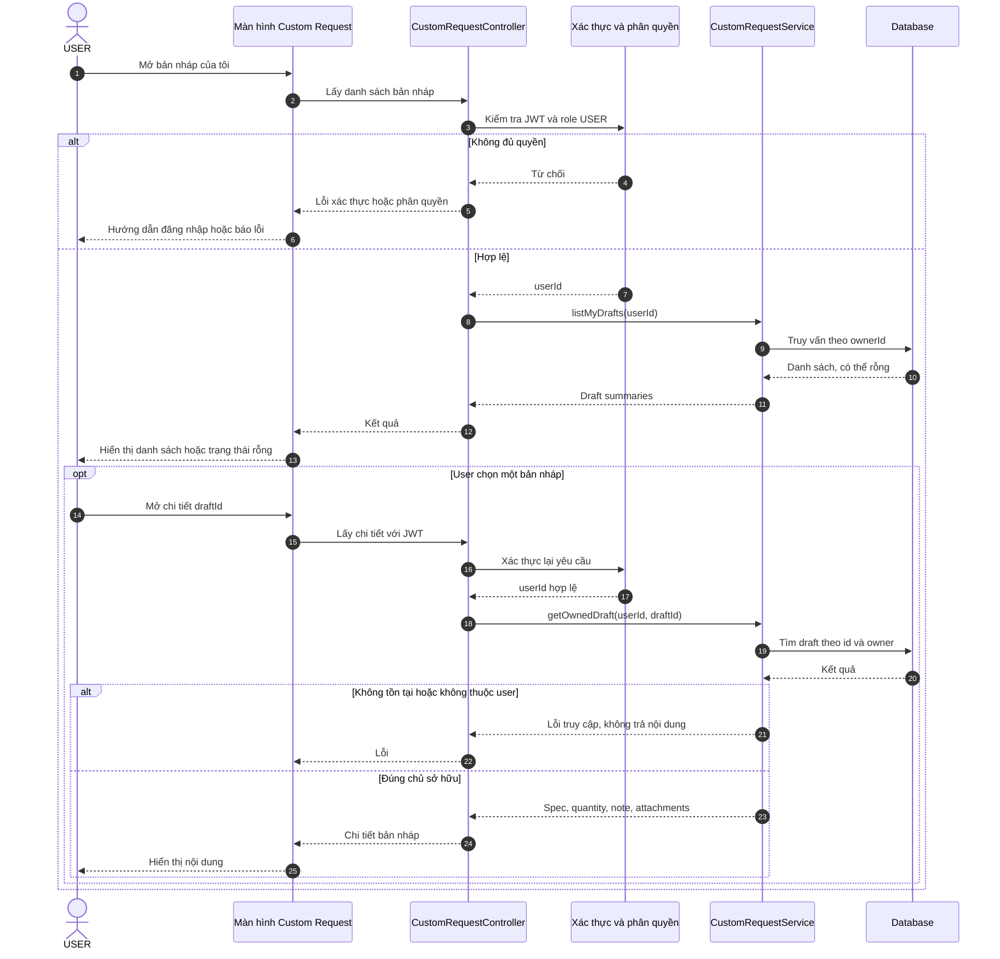
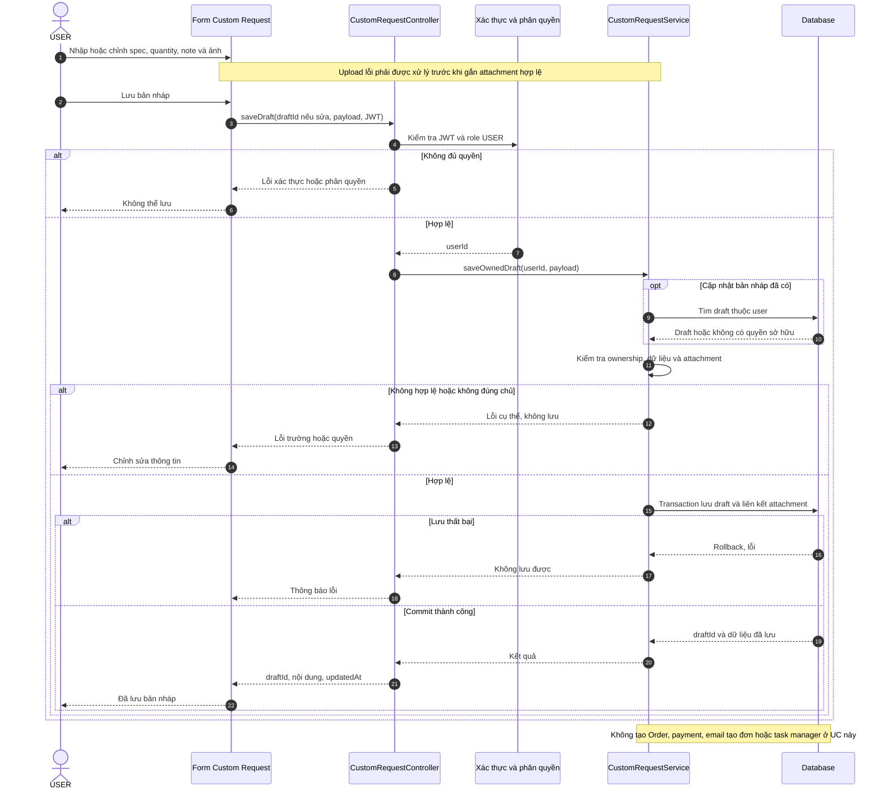

# WF01 — Biểu đồ tuần tự

Nguồn: [usecase.md](usecase.md) và [target.txt](../../target.txt). [Sơ đồ hoạt động](diagram.md) · [Use Case tổng quan](overview.svg).

Các participant Controller/Service và tên phương thức là phân chia trách nhiệm đề xuất, không khẳng định đã được triển khai đầy đủ. Database bao gồm dữ liệu nghiệp vụ cần lưu; chi tiết từng repository được lược để sơ đồ dễ đọc.

## UC01.1 — Xem danh sách và chi tiết bản nháp



Mọi request xem chi tiết đều phải xác thực, không dựa vào việc đã mở danh sách. Bước xác thực thất bại của request chi tiết được xử lý như request đầu, lược khỏi nhánh để tránh lặp sơ đồ.

## UC01.2 — Tạo/cập nhật bản nháp



Upload/attachment là dữ liệu đầu vào đã được xác minh; quy trình lưu trữ ảnh chi tiết không được áp đặt thêm vào nghiệp vụ WF01. Validation lưu nháp thực hiện theo schema đã thống nhất, không tự coi tất cả trường của đơn đều bắt buộc ngay khi lưu nháp.

## UC01.3 — Gửi bản nháp tạo đơn custom

```mermaid
sequenceDiagram
    autonumber
    actor U as USER
    participant UI as Màn hình gửi yêu cầu
    participant C as CustomRequestController
    participant A as Xác thực và phân quyền
    participant S as CustomOrderService
    participant DB as Database
    participant W as WorkflowStarter
    participant E as EventPublisher
    participant N as Email và Notification Consumer
    U->>UI: Xác nhận gửi bản nháp
    UI->>C: submit(draftId, payload, idempotencyKey, JWT)
    C->>A: Kiểm tra JWT và role USER
    alt Không đủ quyền
        C-->>UI: Từ chối, không tạo đơn
    else Hợp lệ
        A-->>C: userId
        C->>S: submitOwnedDraft(userId, request)
        S->>DB: Đọc draft thuộc user và kết quả lần gửi
        DB-->>S: Dữ liệu kiểm tra
        alt Yêu cầu trùng đã thành công
            S-->>C: Order đã tạo
            C-->>UI: orderId hiện có
        else Sai quyền, dữ liệu hoặc key xung đột
            S-->>C: Lỗi, không tạo đơn mới
            C-->>UI: Thông tin cần sửa hoặc lỗi quyền
        else Yêu cầu mới hợp lệ
            S->>S: Chuẩn bị spec và contact snapshot
            S->>DB: Transaction tạo Order, item, liên kết draft và kết quả idempotency
            Note over S,DB: CUSTOM, một loại item, status PENDING_APPROVAL; chống gửi đồng thời ở transaction
            alt Transaction thất bại
                DB-->>S: Rollback
                S-->>C: Lỗi tạo đơn
                C-->>UI: Không có đơn mới hợp lệ
            else Commit thành công
                DB-->>S: orderId
                S->>W: Đăng ký khởi chạy manager review theo orderId
                S->>E: Đăng ký ORDER_CREATED sau commit
                Note over S,E: Lỗi khởi workflow hoặc publish được ghi nhận để retry, không tạo lại Order
                S-->>C: orderId, CUSTOM, PENDING_APPROVAL
                C-->>UI: Tạo đơn thành công
                UI-->>U: Mở MyOrder chờ duyệt
                E-->>N: Event tạo đơn
                N-->>U: Email và notification PENDING_APPROVAL
                Note over W,N: Xử lý bất đồng bộ có idempotency, retry và trạng thái lỗi quan sát được
            end
        end
    end
```

Email/notification không phải điều kiện để trả thành công của transaction tạo đơn. WorkflowStarter/EventPublisher cần đăng ký công việc bền vững hoặc cơ chế retry tương đương; sơ đồ không ngụ ý hai lời gọi sau commit tự bảo đảm không mất tác vụ.

Manager xử lý đơn ở WF02. Timer custom 24 giờ bắt đầu sau manager duyệt; không được đặt vào sequence tạo draft hoặc gửi đơn này.
