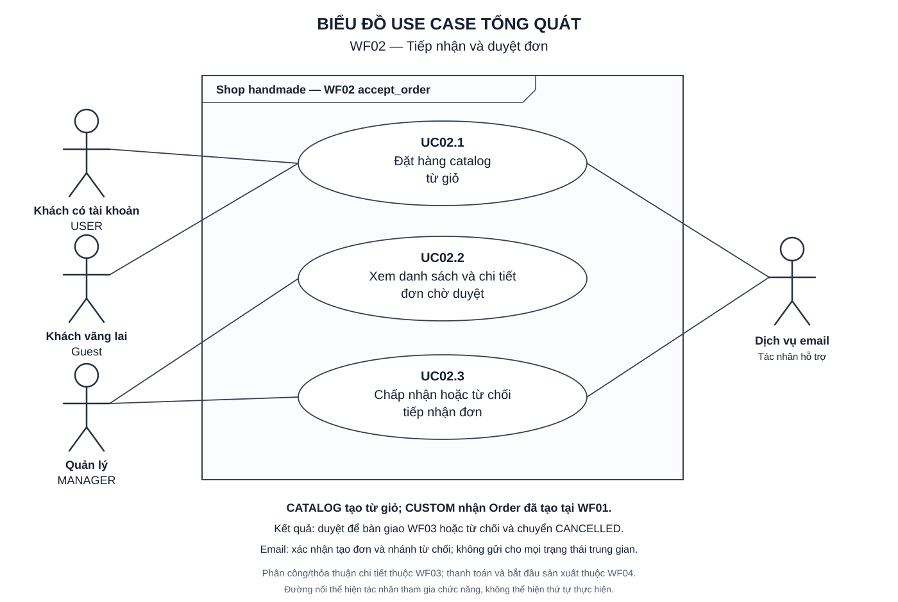

# WF02 — Tiếp nhận và duyệt đơn

Ngày lập: 05/10/2026.

WF02 nhận đơn catalog từ checkout và đơn custom đã được tạo tại WF01, đưa vào hàng chờ manager xét khả năng thực hiện. Kết quả là đơn được duyệt để tiếp tục phân công/thỏa thuận hoặc bị từ chối và hủy.

Nguồn: [target.txt](../../target.txt), mục E/WF02, F04, F06, F07, F16 và F18. Quy cách: [TUTORIAL.md](../TUTORIAL.md).

| File | Nội dung |
|---|---|
| [usecase.md](usecase.md) | UC02.1 checkout catalog; UC02.2 xem đơn chờ; UC02.3 quyết định tiếp nhận |
| [diagram.md](diagram.md) | Sơ đồ hoạt động theo UC và kết nối với các workflow khác |
| [sequence.md](sequence.md) | Biểu đồ tuần tự theo UC, transaction, nhánh lỗi và xử lý sau commit |
| [overview.svg](overview.svg) | Hình Use Case tổng quát để xem hoặc chèn báo cáo |
| [overview.puml](overview.puml) | Mã nguồn Use Case Diagram tương ứng |

Mở SVG bằng Chrome/Edge. Xem diagram.md và sequence.md bằng Markdown preview hỗ trợ Mermaid.

Manager review không tự biến CUSTOM thành ORDER_ACCEPTED. Phân công chi tiết và thỏa thuận nằm ở WF03; thanh toán/staff bắt đầu thuộc WF04. Các tên service trong sequence là thiết kế đề xuất, không khẳng định code hiện tại đã triển khai đủ.
