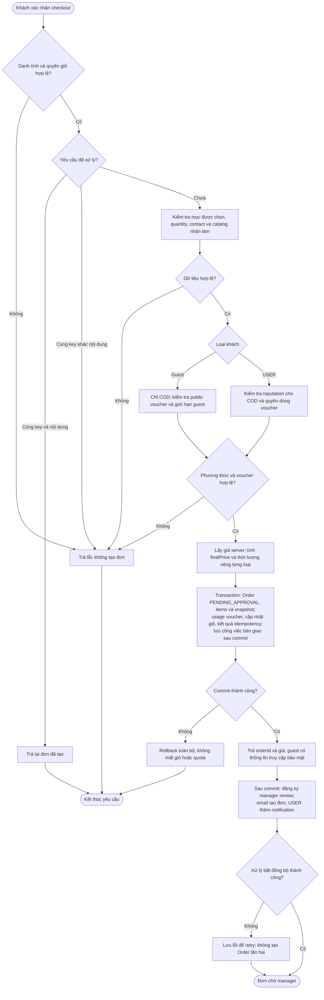
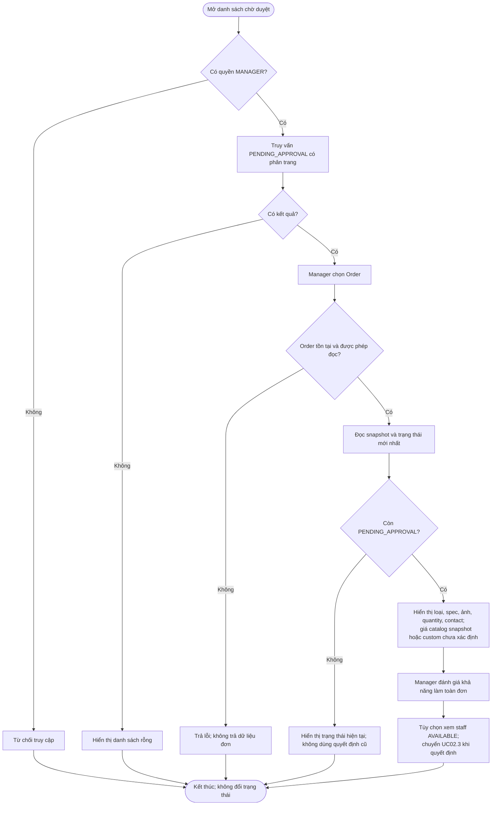
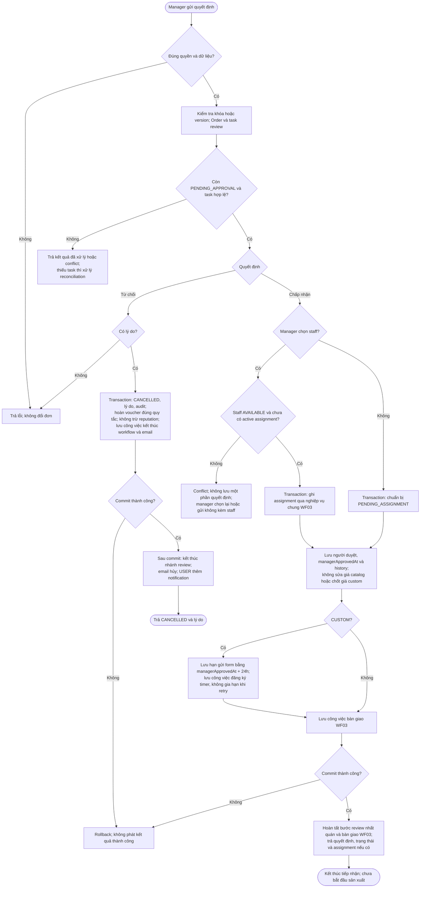
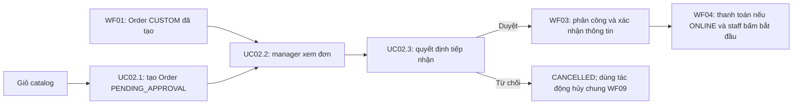

# WF02 — Sơ đồ hoạt động

Nguồn nghiệp vụ: [đặc tả](usecase.md). Sơ đồ dưới đây mô tả hoạt động, không thay thế Use Case Diagram.

## Use Case tổng quát

[Mở SVG](overview.svg) · [Nguồn PlantUML](overview.puml)

## UC02.1 — Đặt hàng catalog từ giỏ

**Giải thích key chống tạo trùng (idempotency key):** đây là mã giao diện tạo cho một lần checkout, không phải mã Order hay mã sản phẩm. Khi gửi lại chính yêu cầu đó vì bấm lặp hoặc mất phản hồi mạng, giao diện dùng lại key. Backend đối chiếu trong phạm vi cùng user/guest và thao tác checkout.

- **Cùng key, cùng nội dung:** gửi lại cùng các mục đặt hàng, quantity, contact, phương thức thanh toán và voucher. Nếu lần trước đã tạo đơn thành công, trả lại đơn đó, không tạo đơn thứ hai.
- **Cùng key, khác nội dung:** dùng lại key nhưng đổi dữ liệu, ví dụ quantity từ 2 thành 3. Backend báo conflict vì một mã yêu cầu không được đại diện cho hai lần đặt khác nhau. Lần checkout mới dùng key mới, không tự đổi key khi chỉ retry do mất phản hồi.
- Nếu yêu cầu cùng key còn đang xử lý, không chạy thêm một lần tạo đơn song song, xử lý chờ hoặc báo đang xử lý theo hợp đồng API.

Ví dụ: checkout với key `checkout-abc`, quantity = 2 đã tạo Order #123. Gửi lại đúng yêu cầu trả Order #123. Gửi key `checkout-abc` với quantity = 3 bị từ chối do khác nội dung. Đây là thiết kế chống tạo trùng đề xuất, không phải xác nhận code hiện tại đã có cơ chế này.

Guest chỉ nhận email; URL chứa token giới hạn theo Order, không chỉ orderId. Không tạo yêu cầu thanh toán hoặc trừ tồn kho trong UC này. Kết quả idempotency phải được kiểm tra trước khi xem giỏ đã checkout là giỏ rỗng.

## UC02.2 — Xem danh sách và chi tiết đơn chờ duyệt

Danh sách staff chỉ phản ánh thời điểm đọc; thao tác gán phải kiểm tra lại khi ghi.

## UC02.3 — Chấp nhận hoặc từ chối tiếp nhận đơn

Các nhánh ghi assignment và quyết định nằm trong **một transaction nghiệp vụ**, không commit giữa các ô. Nếu engine không cùng transaction DB, công việc bàn giao phải bền vững và retry được. Email/engine lỗi sau commit không làm phát sinh quyết định, quota hay assignment thứ hai.

WF03 xử lý chat và xác nhận thông tin: manager duyệt không tự chốt CUSTOM. Guest CATALOG đã đồng ý mẫu, khi được duyệt và có staff sẽ đi tiếp nhánh xác nhận catalog đến ORDER_ACCEPTED. Không phát email trạng thái trung gian chỉ vì manager vừa duyệt.

## Liên kết giữa các workflow

CUSTOM từ WF01 không đi lại bước tạo đơn UC02.1. Timer gửi form 24h dừng khi user gửi form hợp lệ ở WF03; timer payment 1h thuộc WF04.
