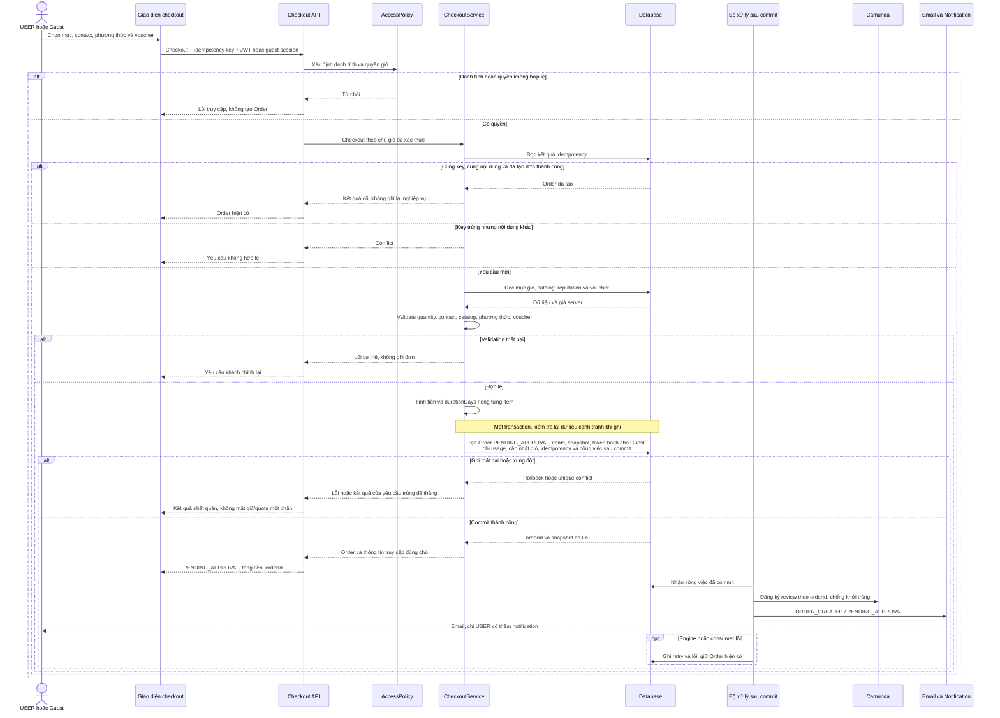
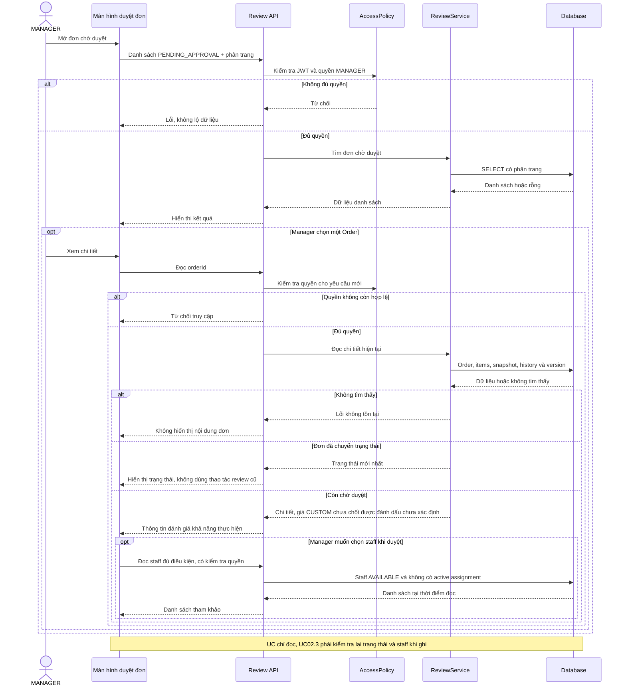
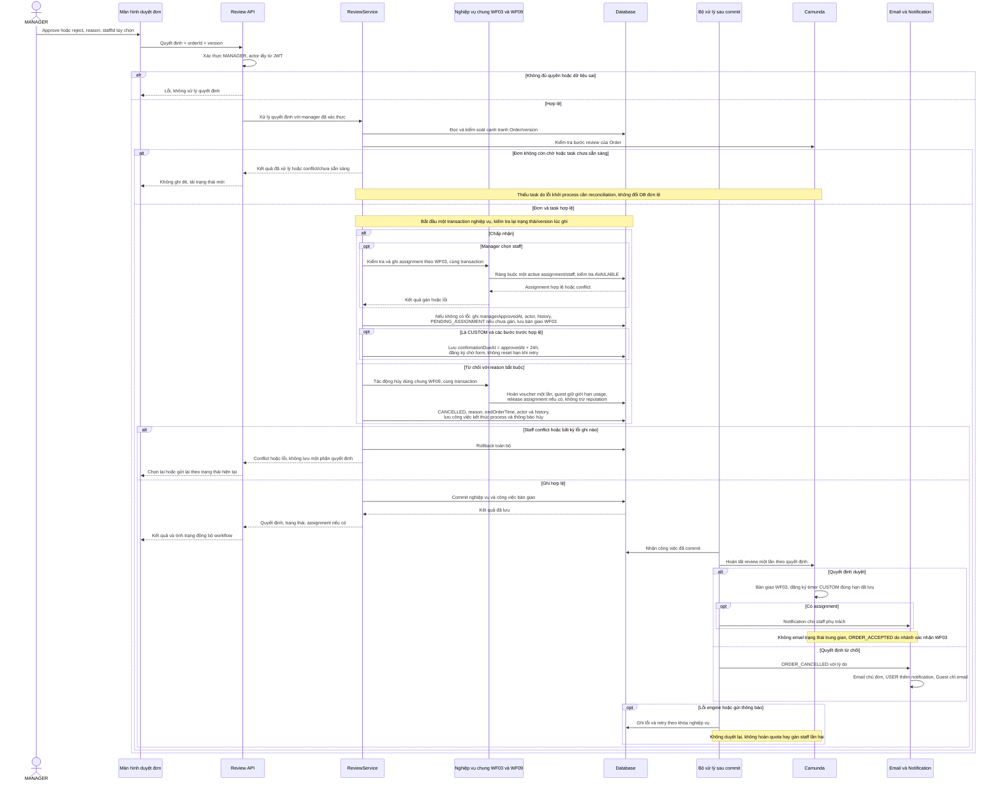

# WF02 — Biểu đồ tuần tự

Nguồn: [đặc tả](usecase.md) · [Activity](diagram.md) · [Use Case tổng quát](overview.svg).

Tên CheckoutService, ReviewService, AccessPolicy và bộ xử lý sau commit dưới đây là **vai trò kỹ thuật đề xuất**, cần ánh xạ với code khi triển khai. Event trong sơ đồ là tên nghiệp vụ, không khẳng định tên topic hiện hành. Các thao tác ghi được gom thành transaction, nếu Camunda không tham gia transaction đó thì dùng bàn giao bền vững/retry có chống trùng.

## UC02.1 — Đặt hàng catalog từ giỏ

Email và khởi process không buộc API chờ. Guest link được kiểm tra token theo Order, truy cập GET không thực hiện hủy. Không tạo payment URL trong checkout.

## UC02.2 — Xem danh sách và chi tiết đơn chờ duyệt

## UC02.3 — Chấp nhận hoặc từ chối tiếp nhận đơn

Sơ đồ minh họa phương án engine tách transaction DB. Worker phải bàn giao đúng thứ tự, chống trùng và không để thao tác kế tiếp chạy khi bước trước chưa đồng bộ. Nếu engine dùng chung transaction thì hoàn tất task trong transaction chung, không vừa hoàn tất ở đó vừa phát lệnh hoàn tất lần nữa.

Timer 24h chỉ dành cho CUSTOM đã được manager duyệt, user gửi form hợp lệ sẽ dừng timer ở WF03. Thanh toán ONLINE và thao tác staff bắt đầu sản xuất thuộc WF04, không được suy ra từ quyết định approve ở đây.
