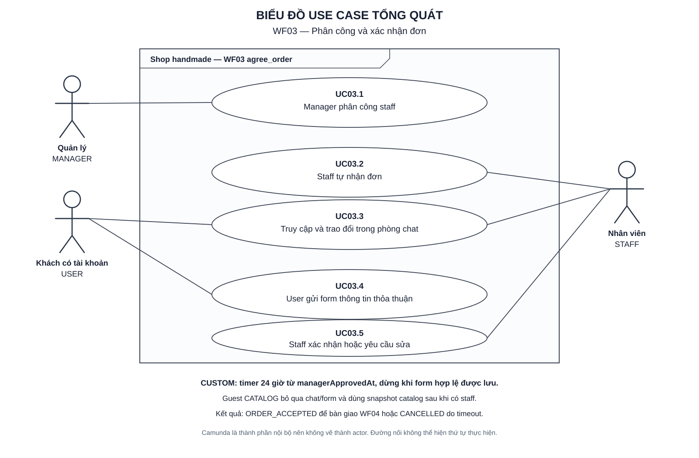

# WF03 — Phân công và xác nhận đơn

Ngày lập: 05/10/2026.

WF03 nhận Order đã được manager duyệt, bảo đảm chỉ một staff đủ điều kiện phụ trách, tạo không gian trao đổi cho đơn của USER và chốt thông tin chính thức trước khi chuyển `ORDER_ACCEPTED`. Guest CATALOG không có chat hoặc bước xác nhận lại mẫu.

Nguồn: [target.txt](../../target.txt), mục C4–C5, D, E/WF03, E1 và F07–F09b. Quy cách: [TUTORIAL.md](../TUTORIAL.md).

| File | Nội dung |
|---|---|
| [usecase.md](usecase.md) | Đặc tả UC03.1–UC03.5, quyền, timer, trạng thái và tiêu chí nghiệm thu |
| [diagram.md](diagram.md) | Activity Diagram cho từng UC và sơ đồ kết nối WF02–WF04 |
| [sequence.md](sequence.md) | Sequence Diagram cho assign/claim, chat, gửi và xác nhận thỏa thuận |
| [overview.svg](overview.svg) | Use Case Diagram tổng quát có actor hình người và chức năng hình oval |
| [overview.puml](overview.puml) | Mã nguồn PlantUML tương ứng |

Mở SVG bằng Chrome/Edge. Xem `diagram.md` và `sequence.md` bằng Markdown Preview hỗ trợ Mermaid.

Tên endpoint, service, event và task kỹ thuật trong tài liệu là thiết kế đề xuất cần ánh xạ khi triển khai. WF03 kết thúc tại `ORDER_ACCEPTED`; tạo payment và staff bắt đầu sản xuất thuộc WF04.
