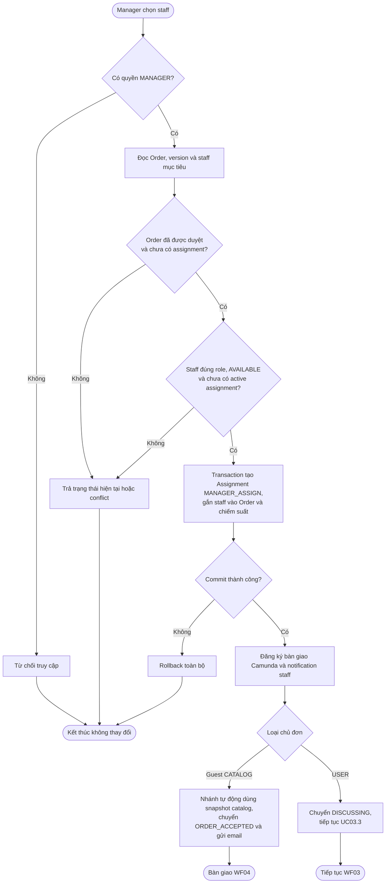
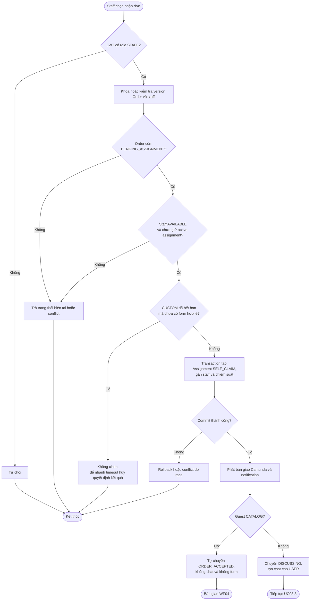
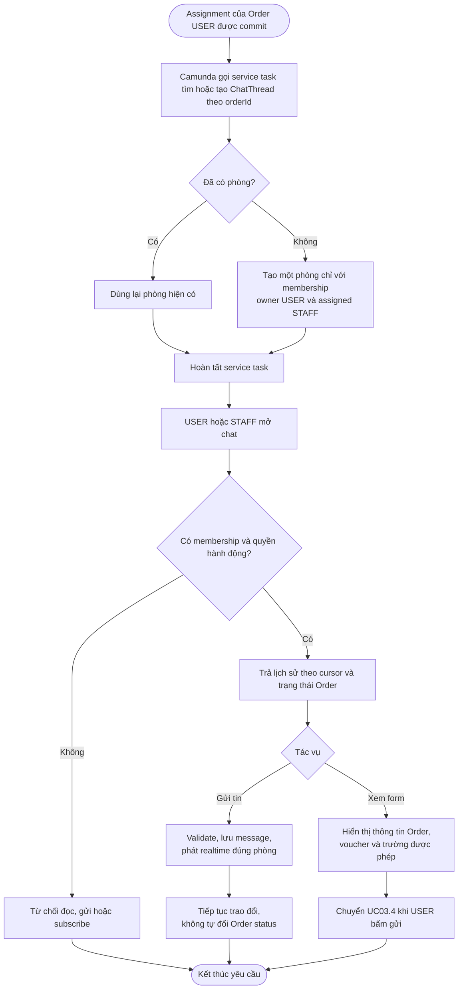
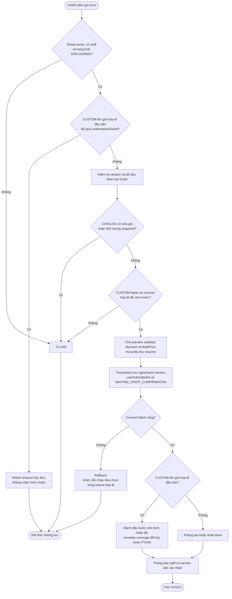
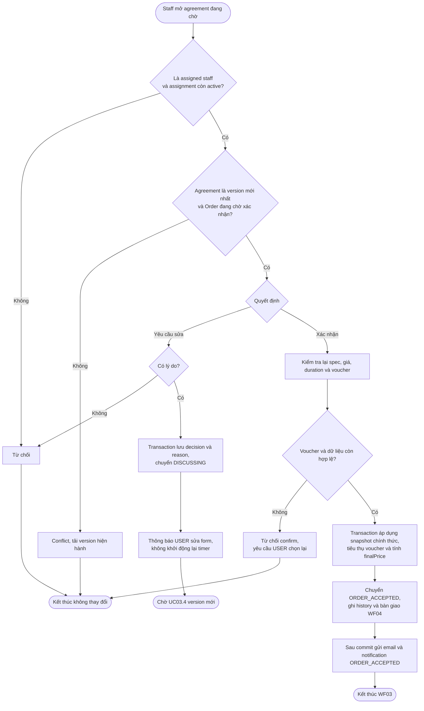
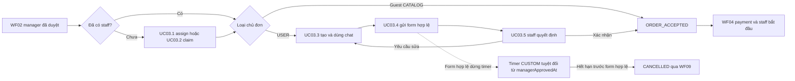

# WF03 — Sơ đồ hoạt động

Nguồn nghiệp vụ: [đặc tả](usecase.md). Đây là Activity Diagram, khác với Use Case Diagram actor/oval.

## Use Case tổng quát

[Mở SVG](overview.svg) · [Nguồn PlantUML](overview.puml)

## UC03.1 — Manager phân công staff

Nếu manager chọn staff ngay trong quyết định duyệt WF02, review và assignment phải dùng cùng hợp đồng nhất quán. Không được lưu “đã duyệt và đã gán” một phần khi staff conflict.

## UC03.2 — Staff tự nhận đơn

Hai staff claim cùng Order và một staff claim hai Order đồng thời đều phải được chặn bằng ràng buộc database hoặc khóa tương đương, không chỉ dựa vào dữ liệu hiển thị trên UI.

## UC03.3 — Truy cập và trao đổi trong phòng chat

Guest CATALOG không vào Activity này. MANAGER không có quyền chat dù là người duyệt hoặc phân công staff. Lỗi WebSocket không phải lý do tạo ChatThread mới hoặc rollback assignment.

## UC03.4 — User gửi form thông tin thỏa thuận

Nếu DB commit form trước nhưng correlation lỗi, trạng thái DB ngăn timeout hủy và reconciliation hoàn tất process sau. Nếu timeout giành quyền cập nhật trước, form gửi muộn bị từ chối.

## UC03.5 — Staff xác nhận hoặc yêu cầu sửa

CATALOG của USER dùng giá và thời lượng snapshot, không nhận giá từ form. Guest CATALOG không có task staff xác nhận trong UC này.

## Liên kết toàn WF03

Timer CUSTOM chỉ bao quanh giai đoạn trước lần gửi form hợp lệ đầu tiên. Timer payment không nằm trong WF03.
