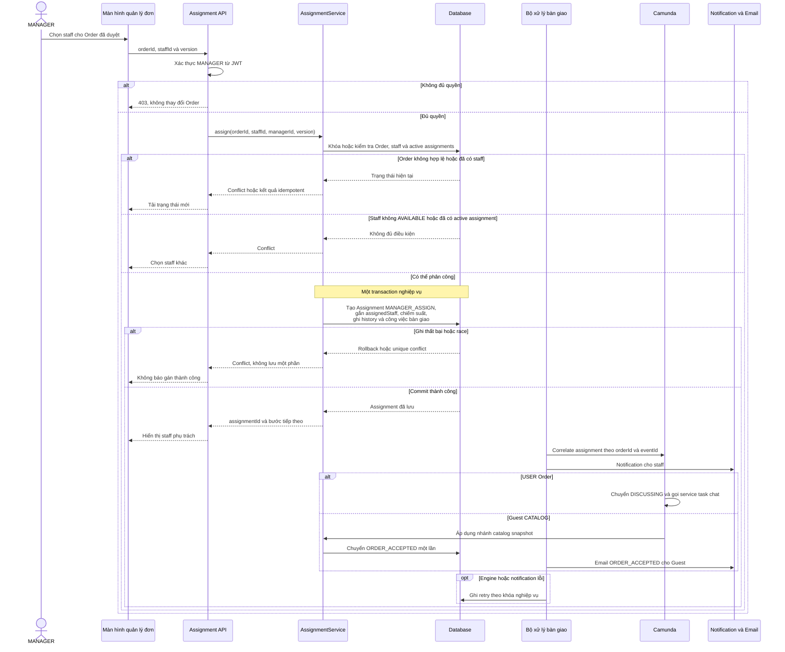
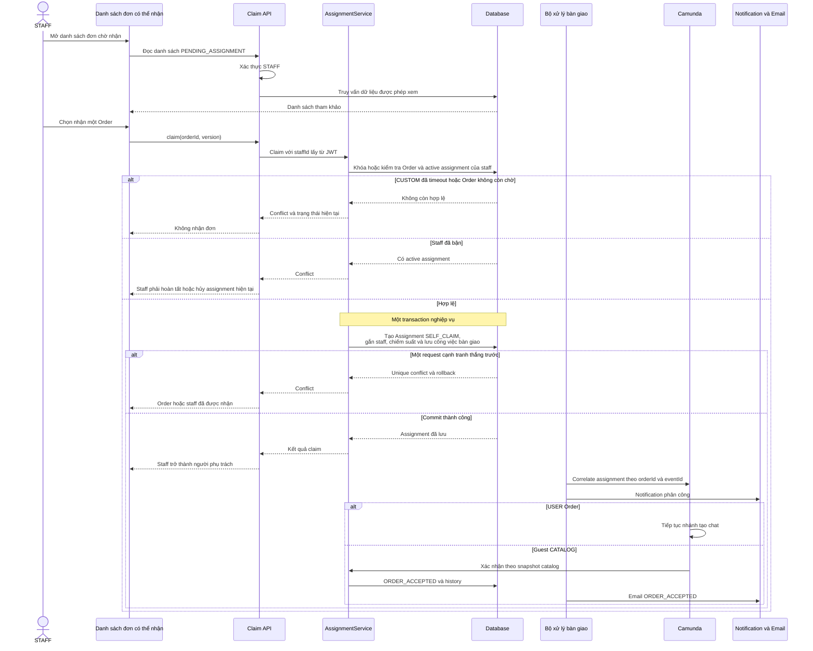
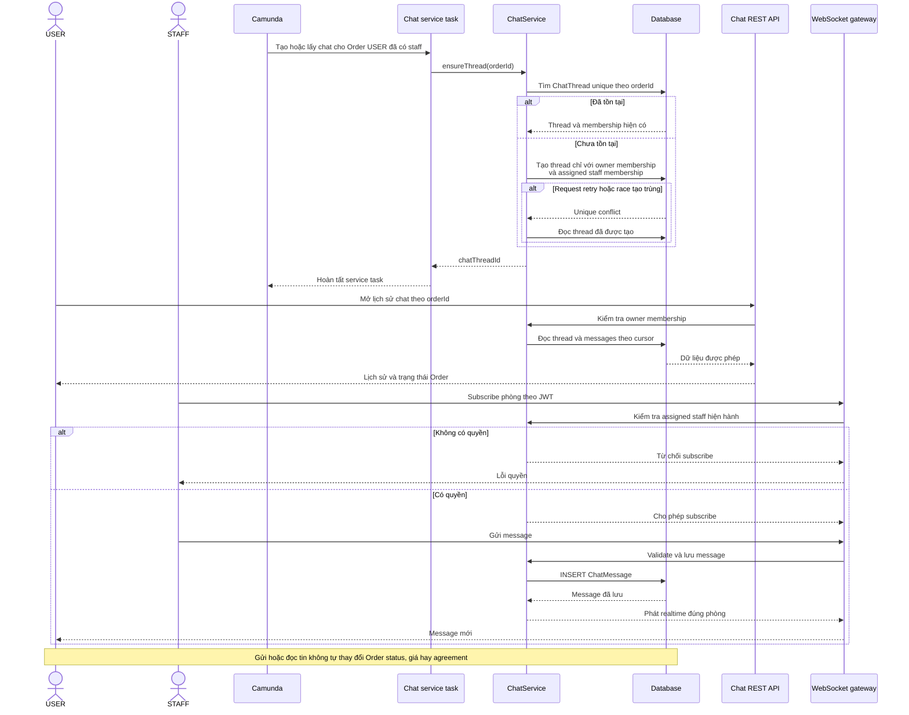
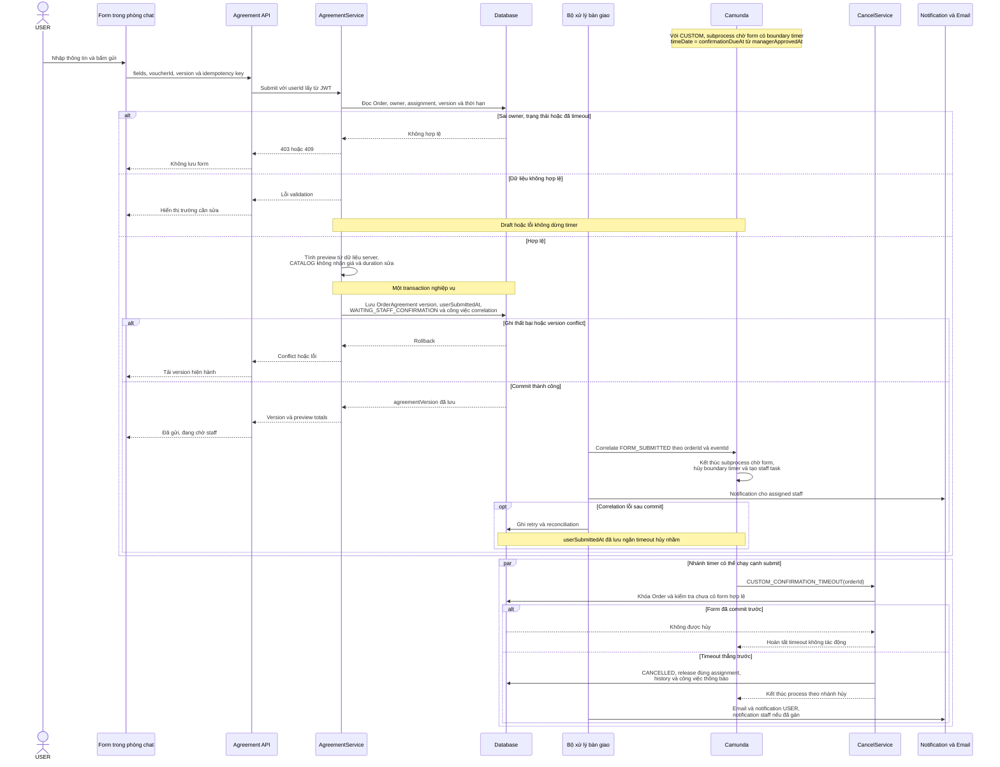
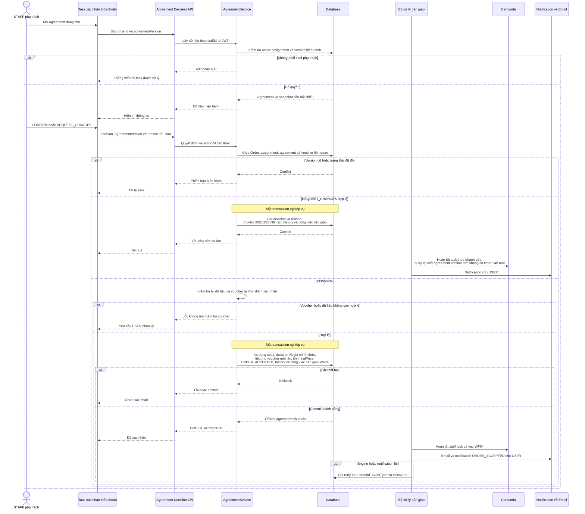

# WF03 — Biểu đồ tuần tự

Nguồn: [đặc tả](usecase.md) · [Activity Diagram](diagram.md) · [Use Case tổng quát](overview.svg).

Tên API, AssignmentService, AgreementService, ChatService và worker dưới đây là vai trò kỹ thuật đề xuất, cần ánh xạ với code khi triển khai. Database là nguồn trạng thái nghiệp vụ, Camunda giữ task, timer và vị trí điều phối. Các message chỉ được correlate sau khi backend đã xác thực và lưu sự kiện nghiệp vụ.

## UC03.1 — Manager phân công staff

Khi manager chọn staff trong cùng request duyệt WF02, `ReviewService` và `AssignmentService` phải phối hợp theo một transaction hoặc hợp đồng bàn giao bền vững đã định nghĩa, không commit quyết định “đã gán” nếu assignment conflict.

## UC03.2 — Staff tự nhận đơn

Request claim lặp của chính staff đã nhận cùng Order có thể trả assignment hiện có. Nó không tạo record, notification hoặc correlation thứ hai.

## UC03.3 — Truy cập và trao đổi trong phòng chat

REST đọc lịch sử, REST gửi nếu có và WebSocket subscribe đều phải kiểm tra quyền riêng. Chỉ USER sở hữu Order và STAFF đang phụ trách có membership. MANAGER, Guest và staff không phụ trách không được đọc, gửi hoặc subscribe.

## UC03.4 — User gửi form thông tin thỏa thuận

Sau lần submit hợp lệ đầu tiên, staff yêu cầu sửa không tạo lại timer. Form version mới vẫn đi qua kiểm tra version và idempotency nhưng không chịu một cửa sổ 24 giờ mới.

## UC03.5 — Staff xác nhận hoặc yêu cầu sửa

UC03.5 không tạo payment. Khi Order đã `ORDER_ACCEPTED`, WF04 mới rẽ COD hoặc mở PaymentAttempt ONLINE. Lỗi gửi email không được rollback thỏa thuận, trừ voucher lần nữa hoặc yêu cầu staff xác nhận lại.
