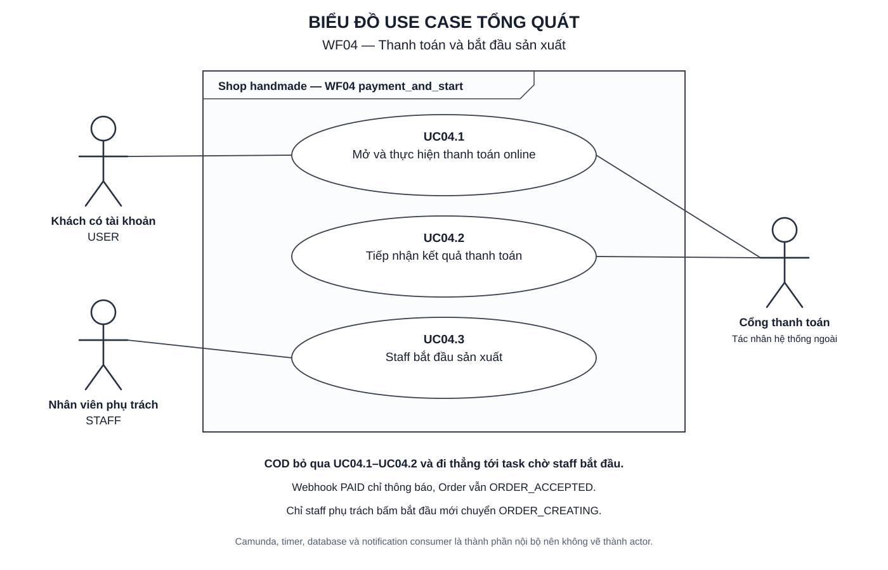
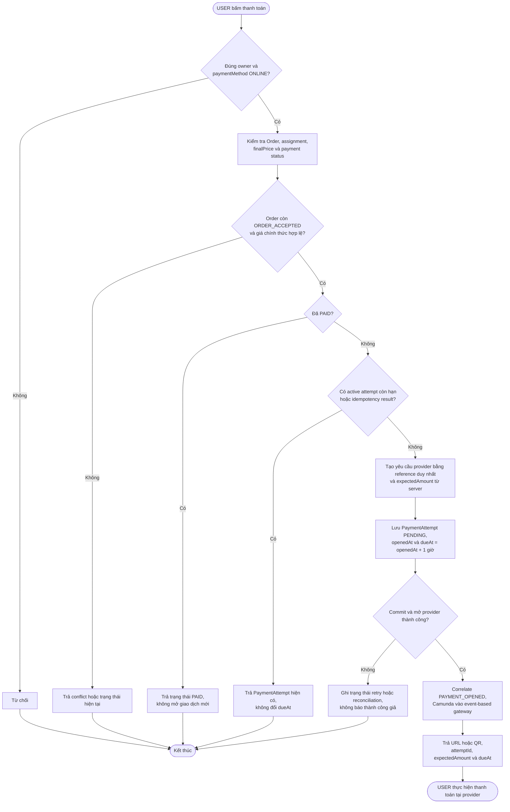
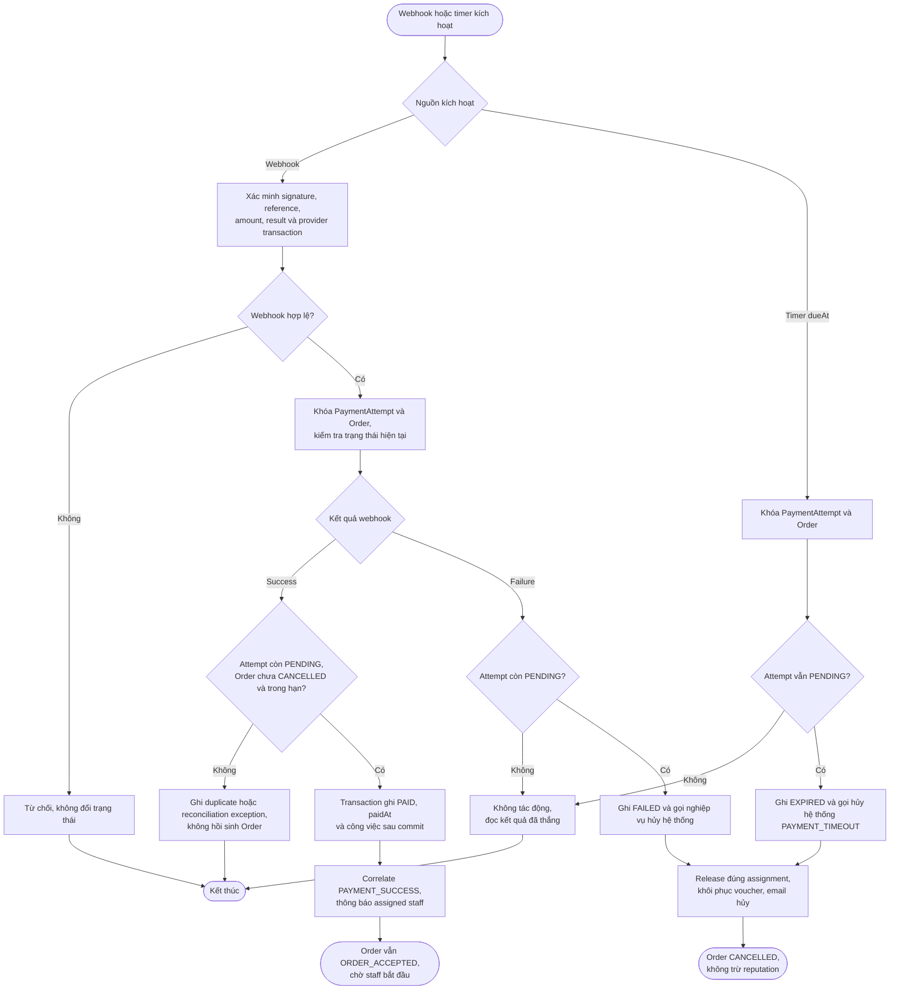
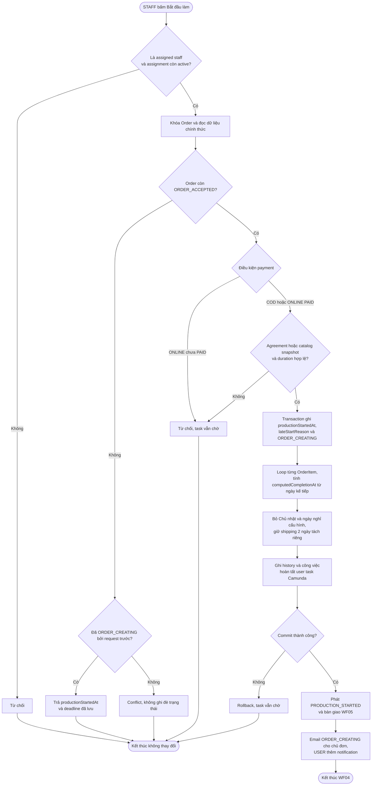
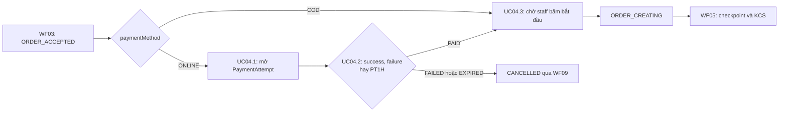

# WF04 — Sơ đồ hoạt động

Nguồn nghiệp vụ: [đặc tả](usecase.md). Đây là Activity Diagram, khác với Use Case Diagram actor/oval.

## Use Case tổng quát

[Mở SVG](overview.svg) · [Nguồn PlantUML](overview.puml)

## UC04.1 — Mở và thực hiện thanh toán online

Timer PT1H chỉ bắt đầu khi PaymentAttempt được mở. Tài liệu chưa đặt timeout cho khoảng từ `ORDER_ACCEPTED` đến lần đầu USER bấm thanh toán.

## UC04.2 — Tiếp nhận kết quả thanh toán

Nếu PAID đã commit nhưng correlation lỗi, timer phải đọc trạng thái PAID và không hủy. Job bàn giao sẽ retry correlation theo cùng eventId.

## UC04.3 — Staff bắt đầu sản xuất

Việc staff đọc notification payment không đi qua bước chuyển trạng thái. Staff phải thực hiện hành động UC04.3.

## Liên kết toàn WF04

COD do shipper thu ngoài hệ thống. WF04 không có webhook COD và không gán paymentStatus PAID giả cho COD.
