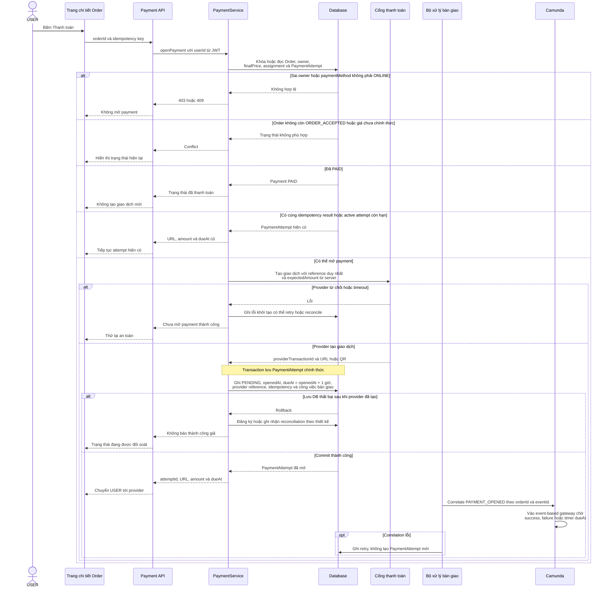
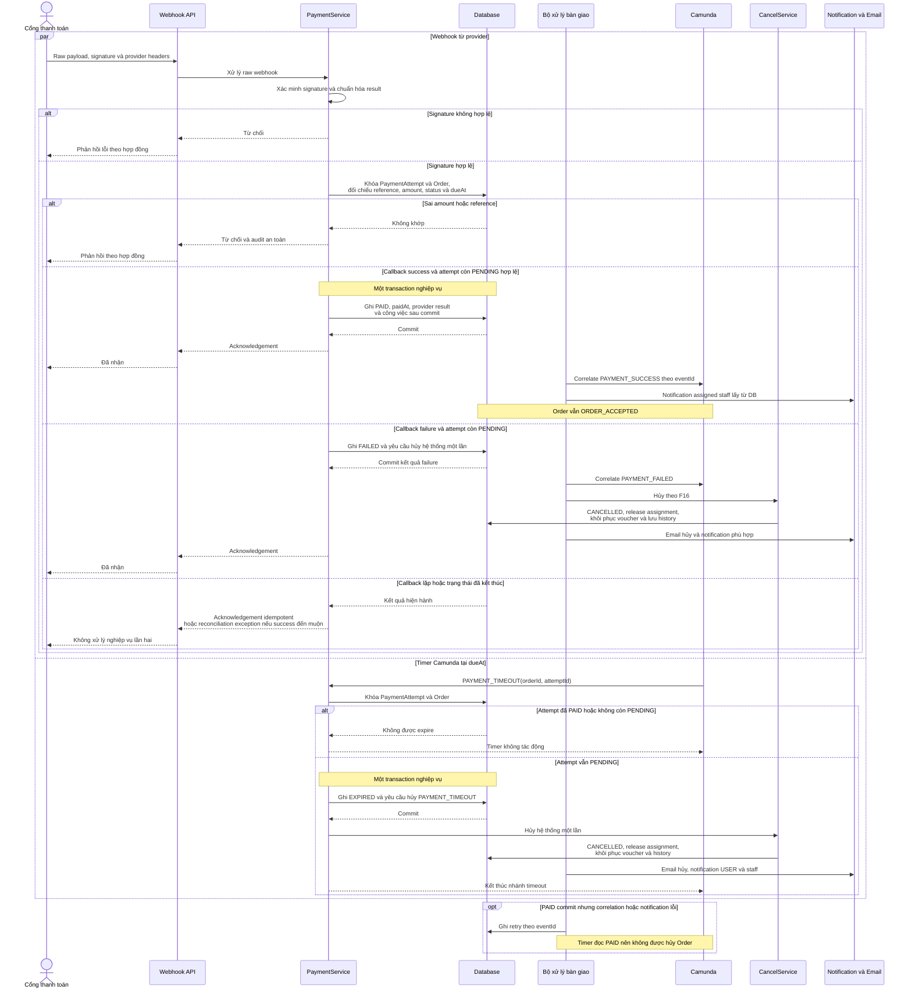
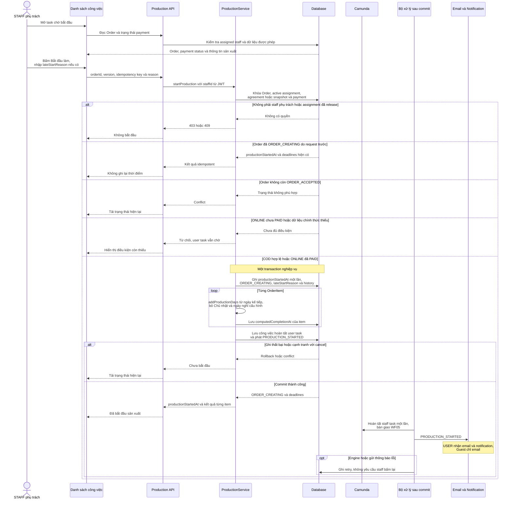

# WF04 — Biểu đồ tuần tự

Nguồn: [đặc tả](usecase.md) · [Activity Diagram](diagram.md) · [Use Case tổng quát](overview.svg).

Tên PaymentService, ProductionService, worker và event dưới đây là vai trò kỹ thuật đề xuất. Database giữ trạng thái nghiệp vụ, Camunda điều phối message, timer và user task. Webhook được xác minh và commit trước khi correlate vào process.

## UC04.1 — Mở và thực hiện thanh toán online

Provider API là side effect ngoài transaction database. Triển khai cần reference và idempotency ổn định để phục hồi tình huống provider đã tạo giao dịch nhưng phản hồi hoặc lưu DB gặp lỗi.

## UC04.2 — Tiếp nhận kết quả thanh toán

Webhook và timer có thể chạy đồng thời nhưng khóa/trạng thái database phải chọn một kết quả. Callback thành công đến sau khi `EXPIRED/CANCELLED` chỉ tạo ngoại lệ đối soát, không tự phục hồi Order hoặc tự công bố hoàn tiền.

## UC04.3 — Staff bắt đầu sản xuất

Staff vẫn giữ active assignment sau UC04.3. WF05 chỉ release khi mọi loại sản phẩm qua KCS checkpoint 2, hoặc nghiệp vụ hủy release trước đó.
