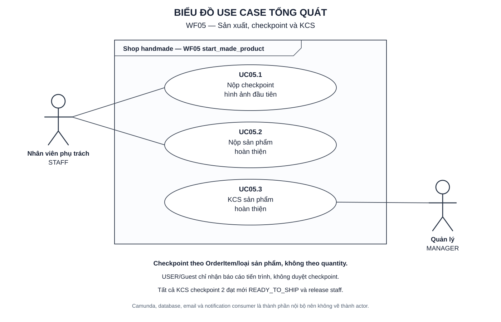
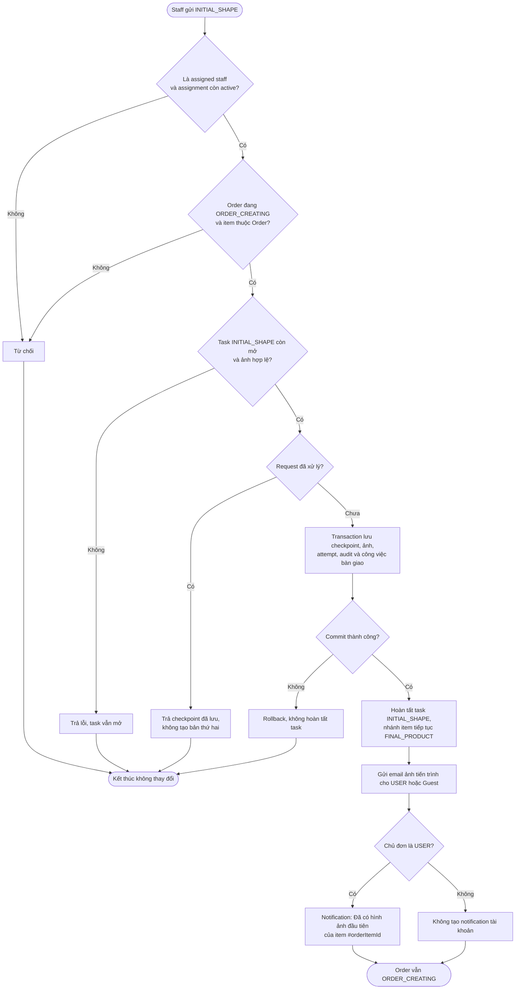
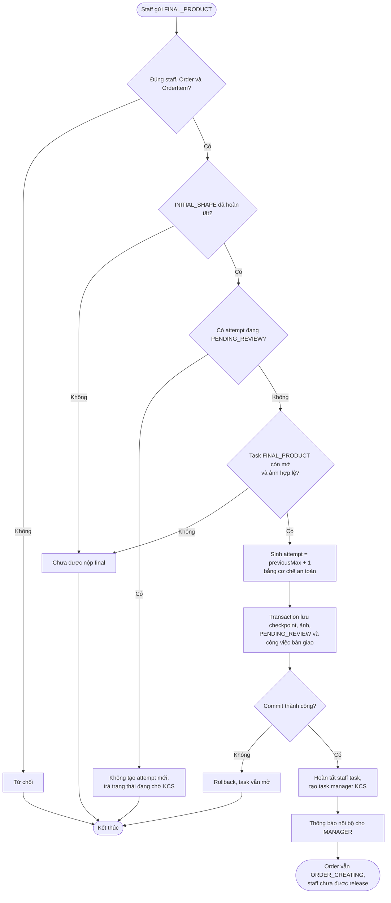
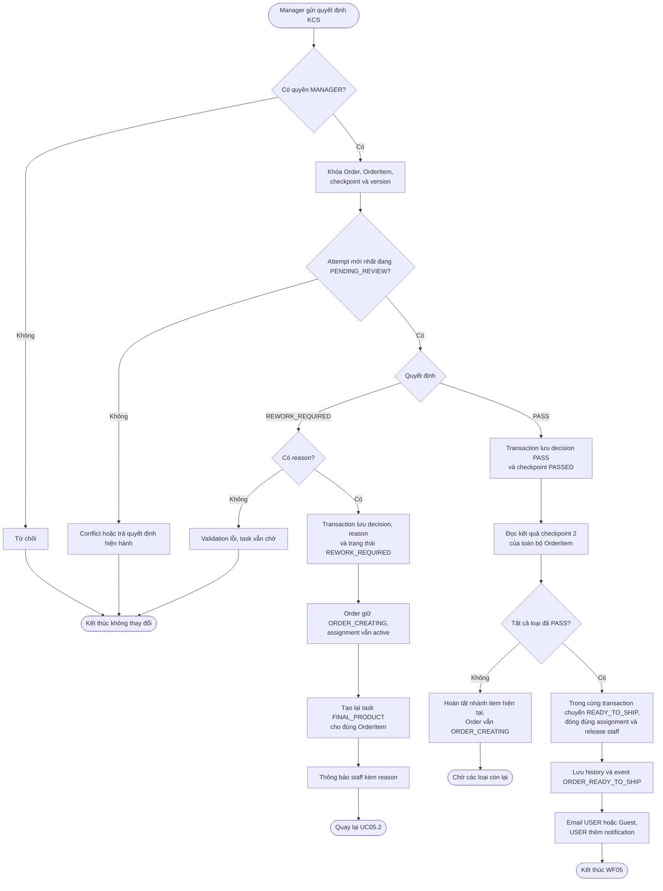
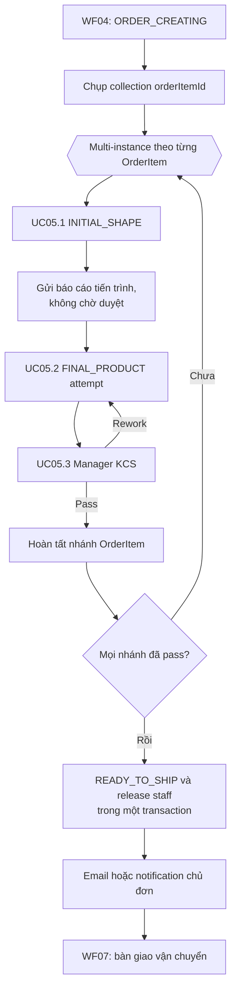

# WF05 — Sơ đồ hoạt động

Nguồn nghiệp vụ: [đặc tả](usecase.md). Đây là Activity Diagram, khác với Use Case Diagram actor/oval.

## Use Case tổng quát

[Mở SVG](overview.svg) · [Nguồn PlantUML](overview.puml)

## UC05.1 — Staff nộp checkpoint hình ảnh đầu tiên

Checkpoint 1 không có manager/customer approval. Lỗi email được retry sau commit và không chặn staff tiếp tục sản xuất.

## UC05.2 — Staff nộp sản phẩm hoàn thiện

Sau khi manager yêu cầu rework, UC05.2 được thực hiện lại cho đúng OrderItem và sinh attempt mới. Attempt cũ không bị ghi đè.

## UC05.3 — Manager KCS sản phẩm hoàn thiện

Hai nhánh cuối PASS gần đồng thời phải khóa Order và điều kiện hội tụ để chỉ một lần chuyển `READY_TO_SHIP`, release assignment và phát event.

## Điều phối toàn WF05 theo loại sản phẩm

Multi-instance có thể điều phối các loại độc lập nhưng không đồng nghĩa một staff vật lý làm song song. Quantity không được dùng làm loop cardinality.
