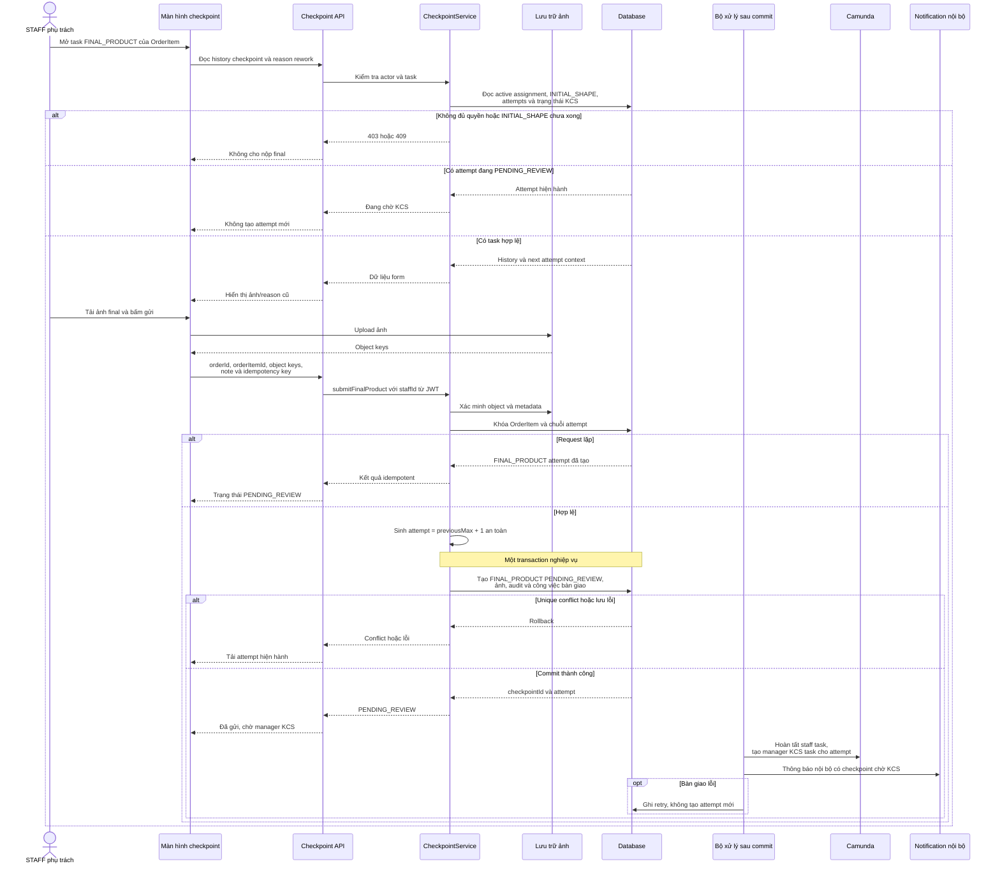
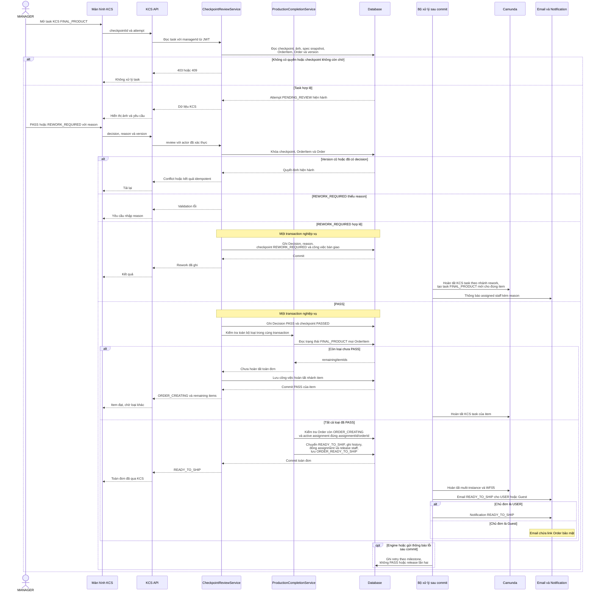

# WF05 — Biểu đồ tuần tự

Nguồn: [đặc tả](usecase.md) · [Activity Diagram](diagram.md) · [Use Case tổng quát](overview.svg).

Tên CheckpointService, ProductionCompletionService, storage và worker dưới đây là vai trò kỹ thuật đề xuất. Database giữ trạng thái checkpoint, attempt, KCS và assignment. Camunda điều phối user task, multi-instance và vòng lặp rework.

## UC05.1 — Staff nộp checkpoint hình ảnh đầu tiên

```mermaid
sequenceDiagram
    actor Staff as STAFF phụ trách
    participant UI as Màn hình checkpoint
    participant API as Checkpoint API
    participant S as CheckpointService
    participant Storage as Lưu trữ ảnh
    participant DB as Database
    participant Jobs as Bộ xử lý sau commit
    participant Engine as Camunda
    participant Notify as Email và Notification

    Staff->>UI: Mở task INITIAL_SHAPE của OrderItem
    UI->>API: Đọc task và dữ liệu item
    API->>S: Kiểm tra staffId từ JWT
    S->>DB: Đọc Order, item, active assignment và task reference
    alt Không phải staff phụ trách hoặc sai trạng thái
        DB-->>S: Không hợp lệ
        S-->>API: 403 hoặc 409
        API-->>UI: Không cho nộp
    else Có quyền
        DB-->>S: Dữ liệu item được phép
        S-->>API: Task INITIAL_SHAPE
        API-->>UI: Hiển thị form
        Staff->>UI: Chọn ảnh, ghi chú và bấm gửi
        UI->>Storage: Tải ảnh theo cơ chế có kiểm soát
        Storage-->>UI: Object key và metadata
        UI->>API: orderId, orderItemId, object keys,<br/>note và idempotency key
        API->>S: submitInitialShape với actor đã xác thực
        S->>Storage: Xác minh object thuộc request và đạt policy
        S->>DB: Khóa Order, item, assignment và stage
        alt Ảnh, quyền hoặc stage không hợp lệ
            S-->>API: Lỗi, task vẫn mở
            API-->>UI: Hiển thị lỗi
        else Request đã xử lý
            DB-->>S: Checkpoint hiện có
            S-->>API: Kết quả idempotent
            API-->>UI: Không tạo checkpoint thứ hai
        else Hợp lệ
            Note over S,DB: Một transaction nghiệp vụ
            S->>DB: Tạo INITIAL_SHAPE, CheckpointImage,<br/>attempt, audit và công việc sau commit
            alt Ghi thất bại
                DB-->>S: Rollback
                S-->>API: Chưa hoàn tất task
                API-->>UI: Thử lại an toàn
            else Commit thành công
                DB-->>S: checkpointId và submittedAt
                S-->>API: Kết quả checkpoint
                API-->>UI: Đã gửi ảnh đầu tiên
                Jobs->>Engine: Hoàn tất task INITIAL_SHAPE theo eventId
                Jobs->>Notify: Gửi email ảnh tiến trình cho chủ đơn
                alt Chủ đơn là USER
                    Jobs->>Notify: Notification “Đã có hình ảnh đầu tiên<br/>của item #{orderItemId}”
                else Chủ đơn là Guest
                    Note over Notify: Chỉ email, không tạo notification tài khoản
                end
                Engine->>Engine: Mở task FINAL_PRODUCT của item
                opt Engine hoặc thông báo lỗi
                    Jobs->>DB: Ghi retry theo checkpointId và eventType
                end
            end
        end
    end
```

Upload object có thể xảy ra ngoài transaction database. Cần cơ chế dọn object mồ côi theo policy, nhưng không được hoàn tất task nếu Checkpoint và liên kết ảnh chưa commit.

## UC05.2 — Staff nộp sản phẩm hoàn thiện

Client không được tự chọn attempt để ghi đè. Mỗi lần rework tạo một record mới, history cũ vẫn đọc được.

## UC05.3 — Manager KCS sản phẩm hoàn thiện

Hai manager hoặc hai nhánh KCS cuối có thể cạnh tranh. Version/khóa Order và ràng buộc assignment phải bảo đảm một lần chuyển `READY_TO_SHIP`, một lần release và một event trạng thái.
