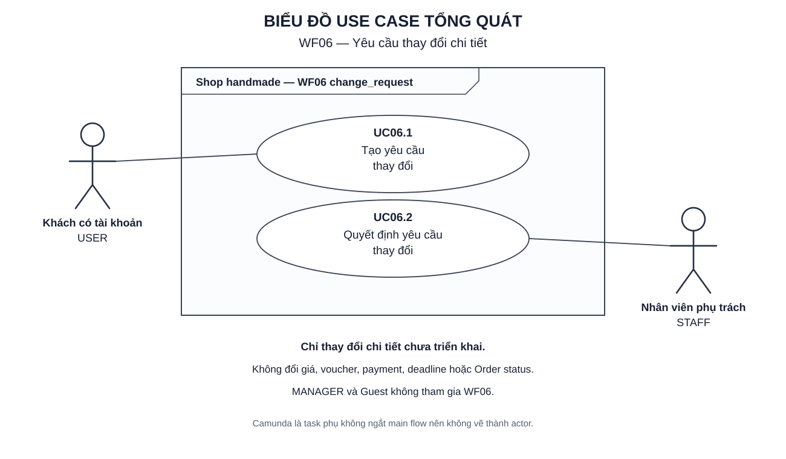
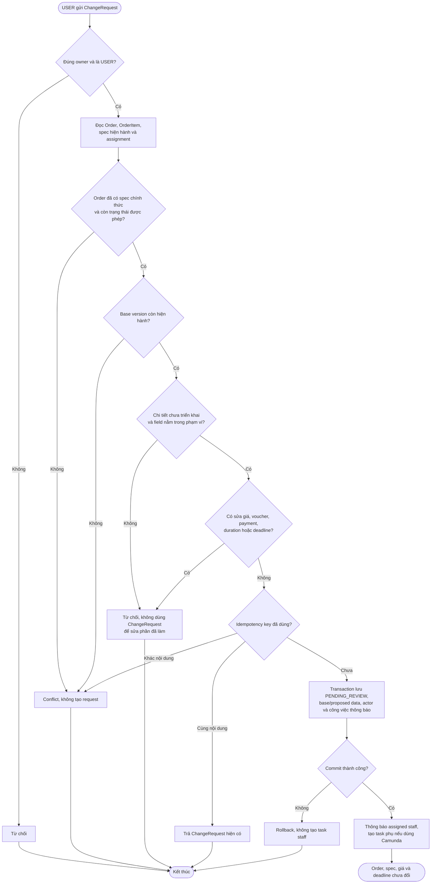
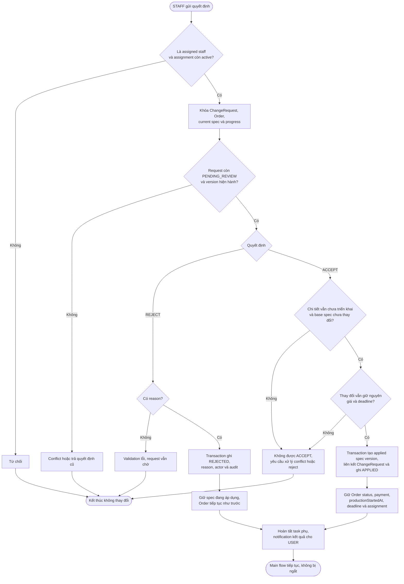
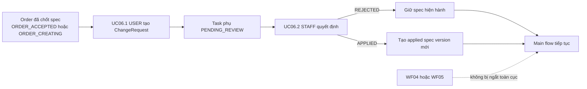

# WF06 — Sơ đồ hoạt động

Nguồn nghiệp vụ: [đặc tả](usecase.md). Đây là Activity Diagram, khác với Use Case Diagram actor/oval.

## Use Case tổng quát

[Mở SVG](overview.svg) · [Nguồn PlantUML](overview.puml)

## UC06.1 — User tạo yêu cầu thay đổi

ChangeRequest là một bản đề nghị, không phải bản cập nhật spec. Chỉ UC06.2 ACCEPT mới tạo applied spec version.

## UC06.2 — Staff quyết định yêu cầu thay đổi

Staff không có lựa chọn tăng giá, tạo payment hoặc đổi deadline trong UC06.2. Nếu cần các thay đổi đó, hệ thống hiện chưa có workflow xử lý.

## Liên kết WF06 với workflow chính

Nếu dùng Camunda, ChangeRequest phù hợp với non-interrupting event subprocess. Không tạo process vòng đời Order thứ hai và không quay ngược trạng thái Order.
