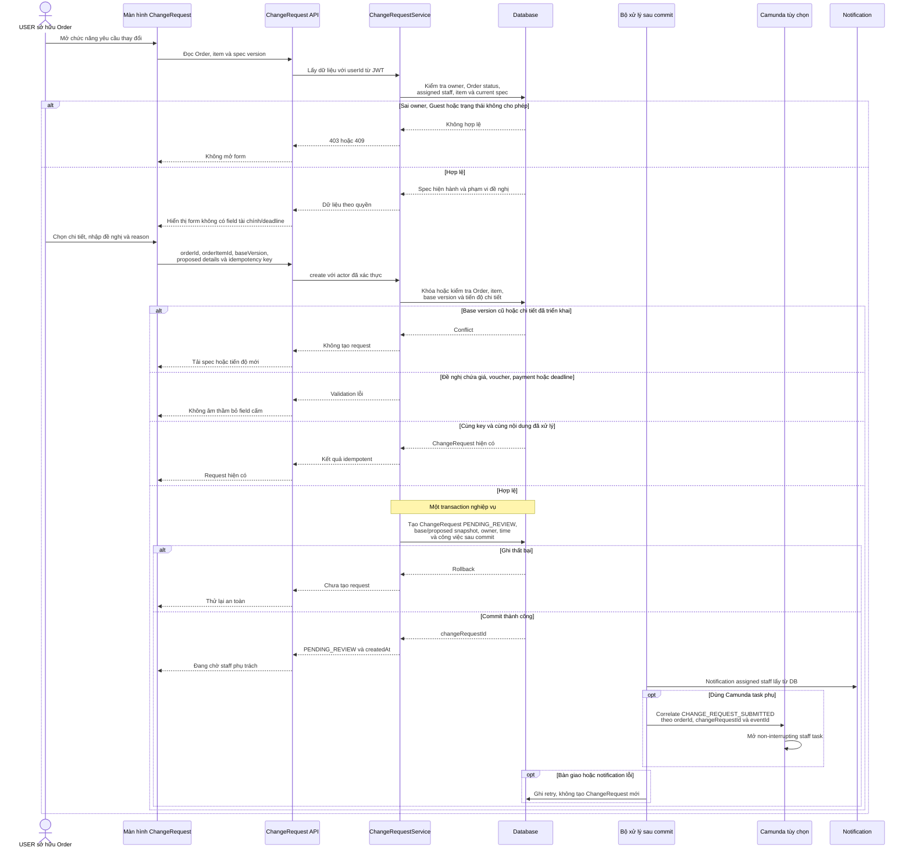
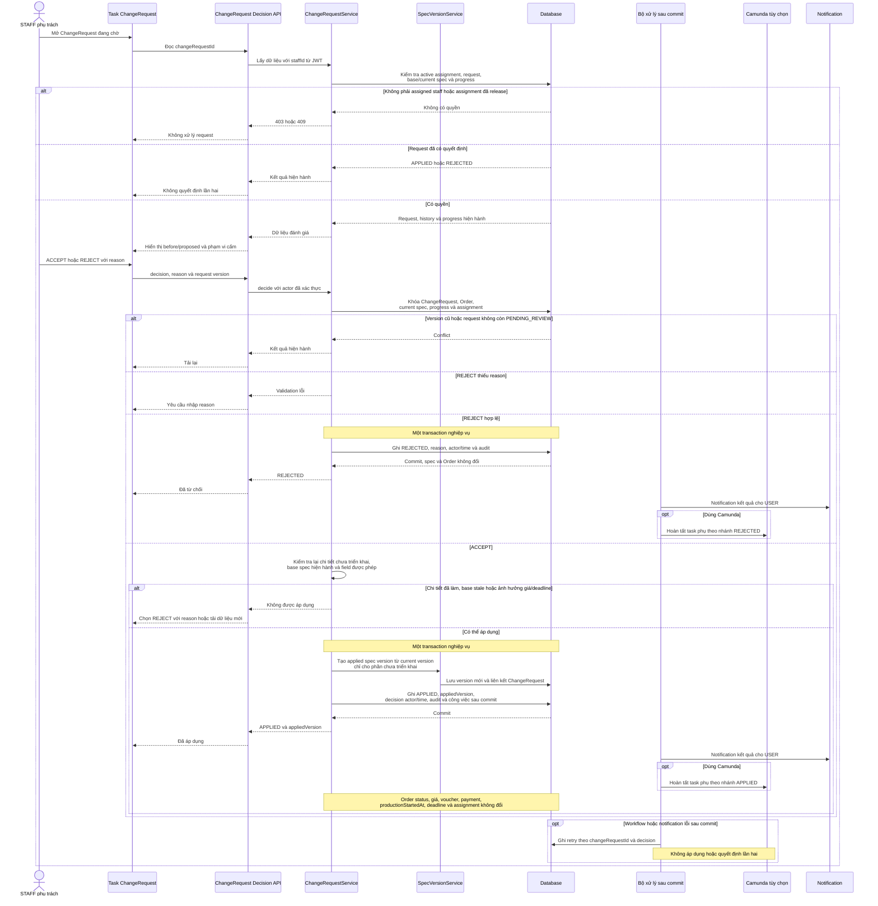

# WF06 — Biểu đồ tuần tự

Nguồn: [đặc tả](usecase.md) · [Activity Diagram](diagram.md) · [Use Case tổng quát](overview.svg).

Tên ChangeRequestService, spec version service, event và task dưới đây là vai trò kỹ thuật đề xuất. WF06 có thể chạy bằng service + notification. Nếu nối Camunda, task được tạo trong non-interrupting event subprocess và không chặn main flow WF04/WF05.

## UC06.1 — User tạo yêu cầu thay đổi

USER submit chỉ tạo đề nghị. Spec, Order status, giá, payment, deadline và checkpoint chưa thay đổi ở UC06.1.

## UC06.2 — Staff quyết định yêu cầu thay đổi

Main process không chờ task phụ WF06 để tiếp tục toàn bộ production. Backend vẫn phải kiểm tra progress tại lúc ACCEPT vì chi tiết có thể đã được triển khai trong thời gian staff chưa quyết định.
