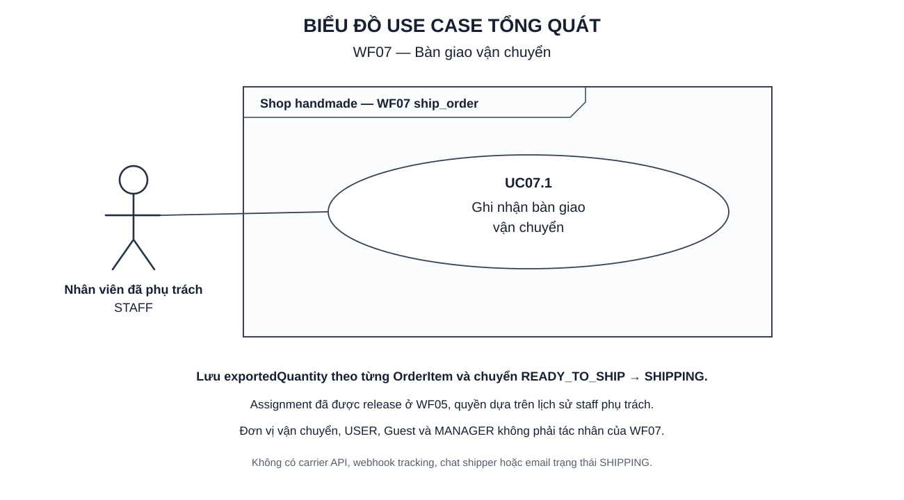
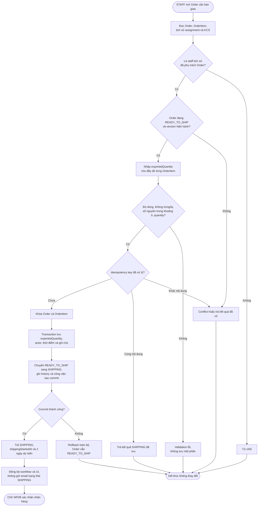
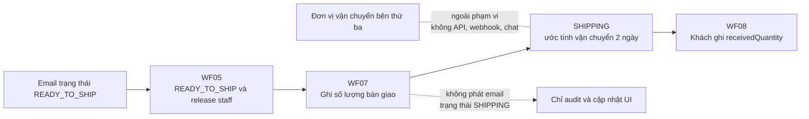

# WF07 — Sơ đồ hoạt động

Nguồn nghiệp vụ: [đặc tả](usecase.md). Đây là Activity Diagram, khác với Use Case Diagram actor/oval.

## Use Case tổng quát

[Mở SVG](overview.svg) · [Nguồn PlantUML](overview.puml)

## UC07.1 — Staff ghi nhận bàn giao vận chuyển

Không kiểm tra assignment còn active vì staff đã được release ở WF05. Backend phải kiểm tra staff lịch sử đã phụ trách và không được release lần hai.

## Ranh giới hệ thống

`SHIPPING` không chứng minh trạng thái thực tế ở hãng vận chuyển. Hệ thống chỉ ghi nhận rằng staff đã bàn giao theo dữ liệu đã nhập.
