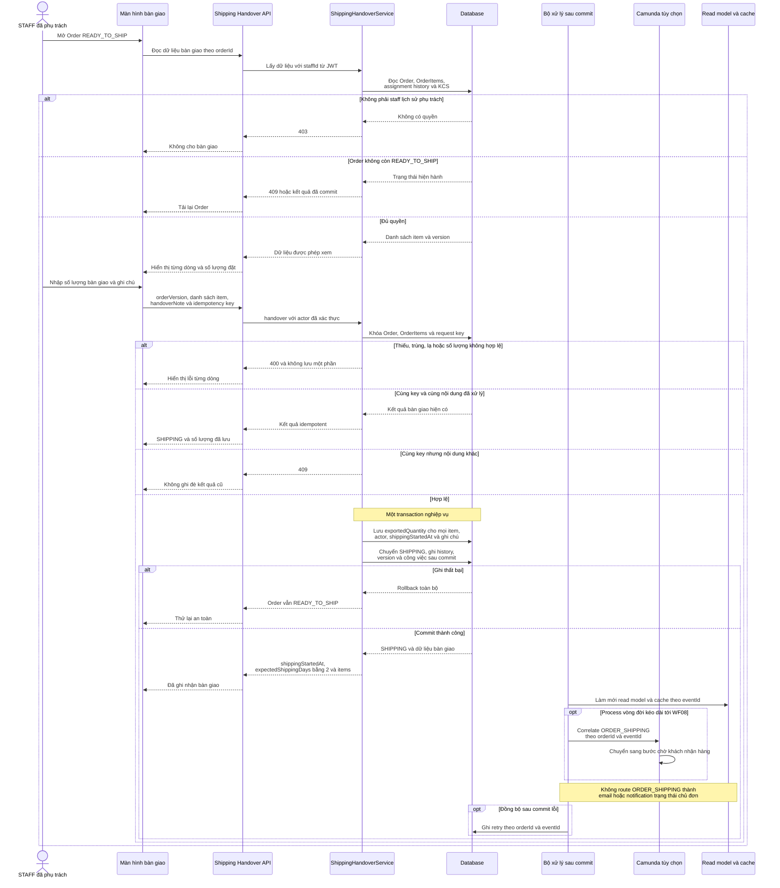

# WF07 — Biểu đồ tuần tự

Nguồn: [đặc tả](usecase.md) · [Activity Diagram](diagram.md) · [Use Case tổng quát](overview.svg).

Tên ShippingHandoverService, event và worker dưới đây là vai trò kỹ thuật đề xuất. Database giữ quyền, số lượng và trạng thái. Không có participant shipper vì bên vận chuyển nằm ngoài phạm vi hệ thống.

## UC07.1 — Staff ghi nhận bàn giao vận chuyển

Không có lời gọi carrier API, webhook tracking hoặc xử lý COD trong sequence này. Nếu job sau commit retry, `eventId` và trạng thái database phải ngăn hoàn tất workflow hoặc cập nhật read model theo nghĩa nghiệp vụ lần hai.
