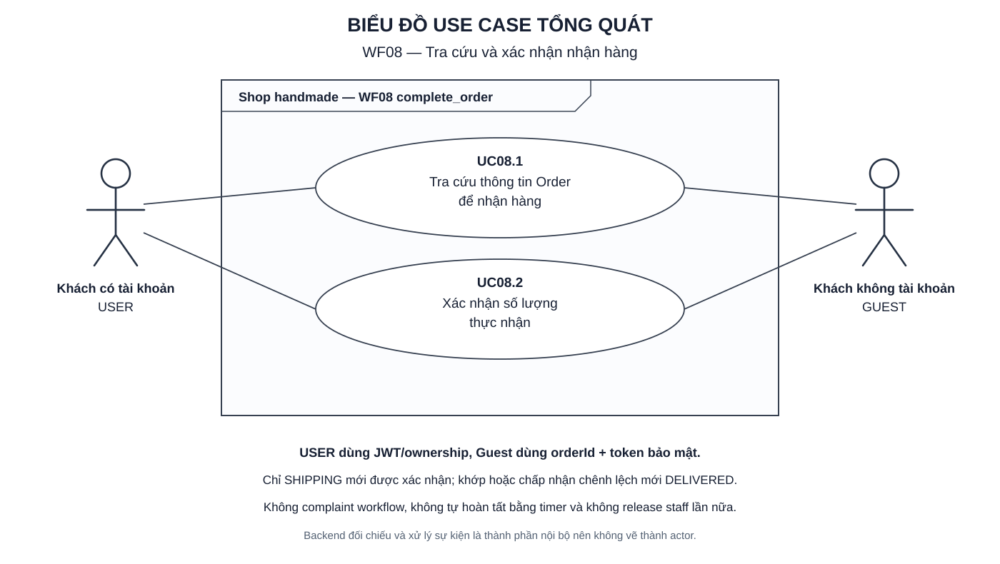

# WF08 — Tra cứu và xác nhận nhận hàng

Ngày lập: 06/10/2026.

WF08 cho USER hoặc Guest mở thông tin Order theo đúng cơ chế xác thực, nhập số lượng thực nhận và hoàn tất đơn. Backend đối chiếu `receivedQuantity` với `exportedQuantity`; nếu có chênh lệch, khách phải chủ động chấp nhận thì Order mới chuyển từ `SHIPPING` sang `DELIVERED`.

Nguồn: [target.txt](../../target.txt), mục B2–B3, C2–C3, D1–D3, E/WF08, F15, F18, G, I–K, M và O. Quy cách: [TUTORIAL.md](../TUTORIAL.md).

| File | Nội dung |
|---|---|
| [usecase.md](usecase.md) | UC08.1–UC08.2, quyền USER/Guest, token, đối chiếu số lượng, reputation, đánh giá catalog và tiêu chí nghiệm thu |
| [diagram.md](diagram.md) | Activity Diagram cho tra cứu và xác nhận thực nhận |
| [sequence.md](sequence.md) | Sequence Diagram cho xác thực, đối chiếu, commit và xử lý sau commit |
| [overview.svg](overview.svg) | Use Case Diagram tổng quát để xem/chèn báo cáo |
| [overview.puml](overview.puml) | Mã nguồn PlantUML tương ứng |

Mở SVG bằng Chrome/Edge. Xem `diagram.md` và `sequence.md` bằng Markdown Preview hỗ trợ Mermaid.

Tên endpoint, service, event và trạng thái kỹ thuật trong tài liệu là thiết kế đề xuất cần ánh xạ khi triển khai. WF08 không tạo complaint workflow, không tự xác nhận khi khách im lặng và không tích hợp hệ thống của shipper.
