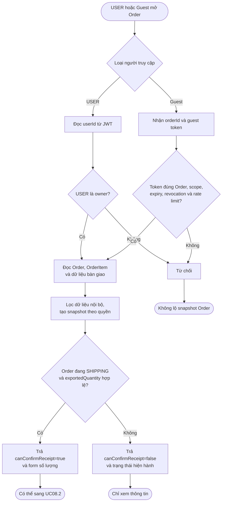
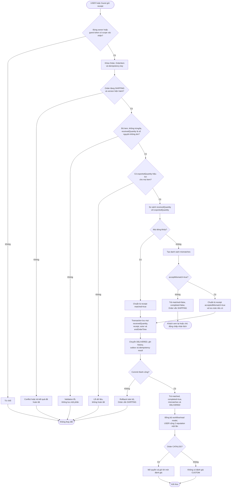
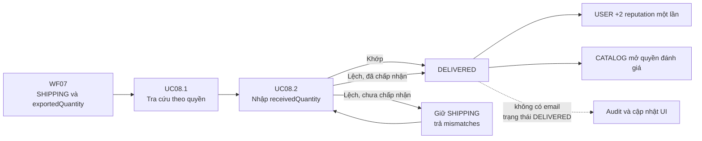

# WF08 — Sơ đồ hoạt động

Nguồn nghiệp vụ: [đặc tả](usecase.md). Đây là Activity Diagram, khác với Use Case Diagram actor/oval.

## Use Case tổng quát

[Mở SVG](overview.svg) · [Nguồn PlantUML](overview.puml)

## UC08.1 — Tra cứu thông tin Order để nhận hàng

Link Guest được gửi ở `READY_TO_SHIP` có thể mở trang nhưng chưa được xác nhận. Chỉ trạng thái `SHIPPING` mới bật thao tác UC08.2.

## UC08.2 — Xác nhận số lượng thực nhận

`matched=false, completed=false` là kết quả nghiệp vụ hợp lệ, không phải lỗi hệ thống. Hệ thống không tự tạo complaint hoặc tự hoàn tất khi khách im lặng.

## Luồng tổng thể WF08

