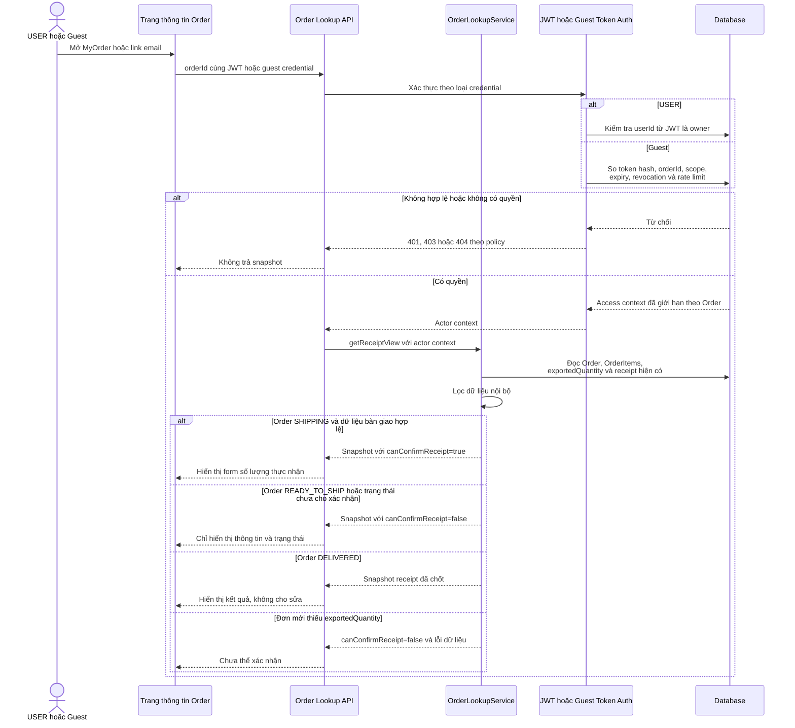
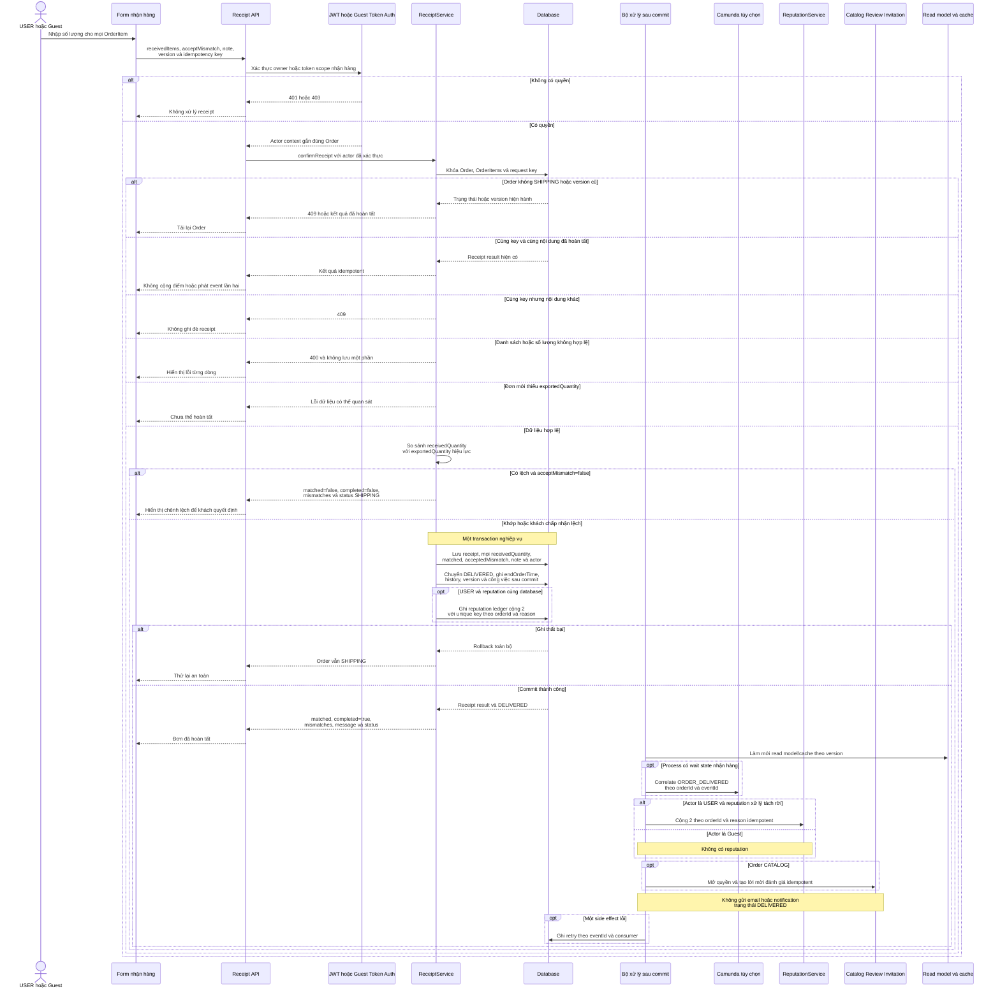

# WF08 — Biểu đồ tuần tự

Nguồn: [đặc tả](usecase.md) · [Activity Diagram](diagram.md) · [Use Case tổng quát](overview.svg).

Tên OrderLookupService, ReceiptService, ReputationService và worker dưới đây là vai trò kỹ thuật đề xuất. Database là nguồn quyết định quyền, trạng thái và số lượng. Guest token phải được băm khi lưu và không xuất hiện trong log hoặc event.

## UC08.1 — Tra cứu thông tin Order để nhận hàng

UC08.1 không tạo task hoặc message Camunda. Đây là chức năng đọc có kiểm soát, `guestSessionId` của giỏ không thay thế token truy cập Order.

## UC08.2 — Xác nhận số lượng thực nhận

Request chênh lệch chưa được chấp nhận không chuyển trạng thái và không kích hoạt side effect hoàn tất. Retry sau khi đã commit phải đọc kết quả đã lưu thay vì chạy lại cộng reputation hoặc phát lời mời đánh giá.
