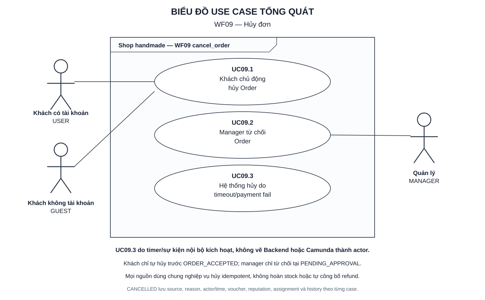

# WF09 — Hủy đơn

Ngày lập: 06/10/2026.

WF09 là nghiệp vụ hủy dùng chung cho ba nguồn: USER/Guest chủ động hủy trước `ORDER_ACCEPTED`, MANAGER từ chối đơn tại bước xét duyệt, và hệ thống hủy do timeout xác nhận custom hoặc payment hết hạn/thất bại. Kết quả phải là một lần chuyển `CANCELLED`, có lịch sử, xử lý voucher/reputation/assignment đúng nguồn và thông báo sau commit.

Nguồn: [target.txt](../../target.txt), mục B2–B3, C3–C4, D1–D3, E/WF09, E1, F09b–F11, F16, F18 và G–K. Quy cách: [TUTORIAL.md](../TUTORIAL.md).

| File | Nội dung |
|---|---|
| [usecase.md](usecase.md) | UC09.1–UC09.3, quyền hủy, mức trừ reputation, voucher, race condition, sự kiện và tiêu chí nghiệm thu |
| [diagram.md](diagram.md) | Activity Diagram cho khách hủy, manager từ chối và hệ thống hủy |
| [sequence.md](sequence.md) | Sequence Diagram cho ba nguồn hủy và xử lý sau commit |
| [overview.svg](overview.svg) | Use Case Diagram tổng quát để xem/chèn báo cáo |
| [overview.puml](overview.puml) | Mã nguồn PlantUML tương ứng |

Mở SVG bằng Chrome/Edge. Xem `diagram.md` và `sequence.md` bằng Markdown Preview hỗ trợ Mermaid.

Tên endpoint, service, event và trạng thái kỹ thuật trong tài liệu là thiết kế đề xuất cần ánh xạ khi triển khai. WF09 không hoàn stock và không tuyên bố hoàn tiền khi chưa có nghiệp vụ hoàn tiền riêng.
