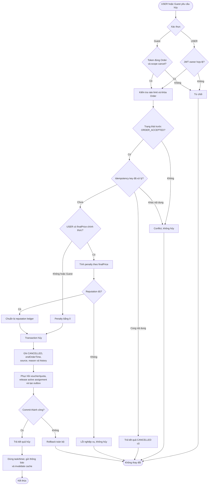
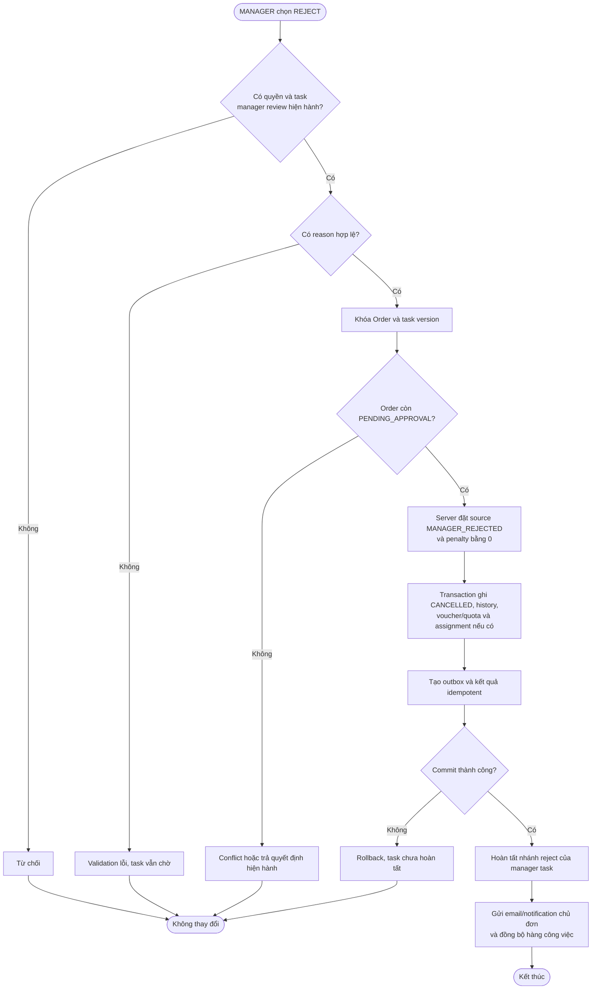
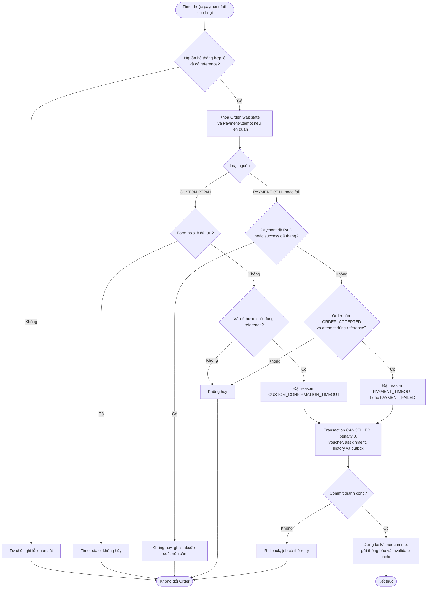
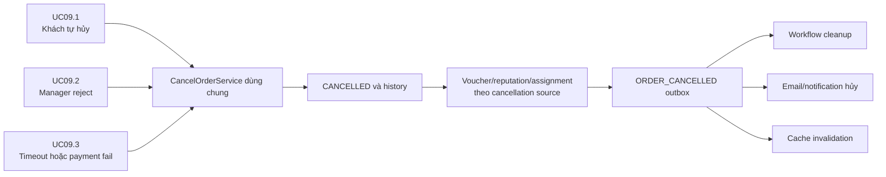

# WF09 — Sơ đồ hoạt động

Nguồn nghiệp vụ: [đặc tả](usecase.md). Đây là Activity Diagram, khác với Use Case Diagram actor/oval.

## Use Case tổng quát

[Mở SVG](overview.svg) · [Nguồn PlantUML](overview.puml)

## UC09.1 — Khách chủ động hủy Order

GET từ link email Guest chỉ mở trang xác nhận. Chỉ mutation sau hành động xác nhận mới đi vào activity trên.

## UC09.2 — Manager từ chối Order

UC09.2 không tạo quyền cho MANAGER hủy Order ở các trạng thái sau manager review.

## UC09.3 — Hệ thống hủy do timeout/payment fail

Timer/webhook/form/staff-start cạnh tranh phải dùng khóa/version để chỉ một kết quả nghiệp vụ có hiệu lực.

## Điều phối nhánh hủy dùng chung

