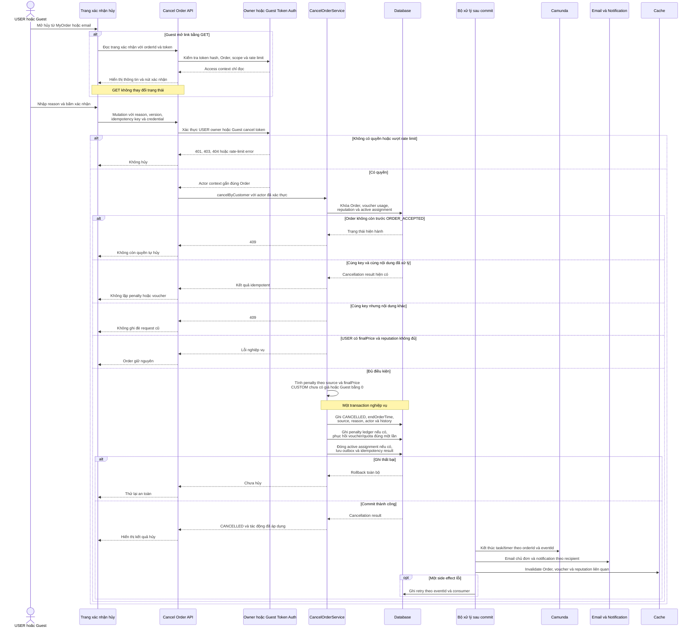
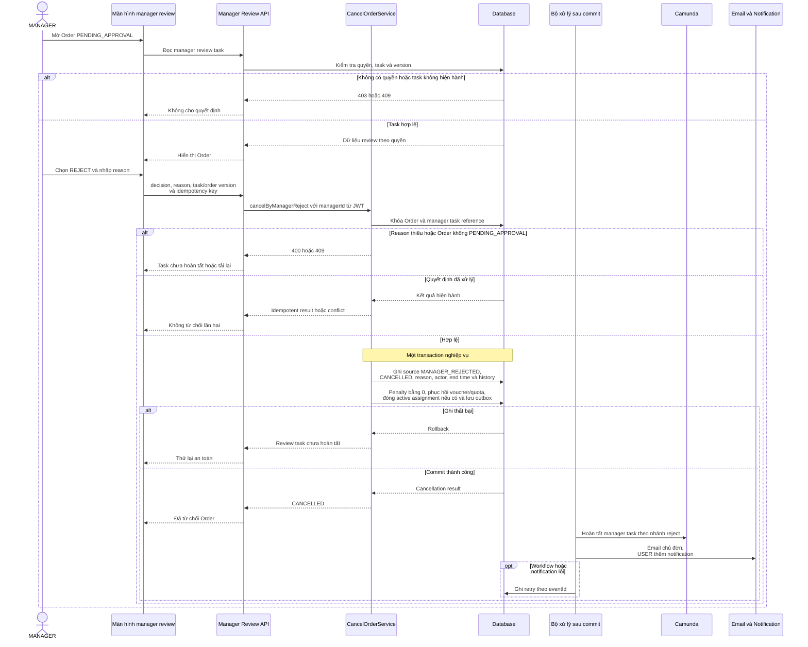
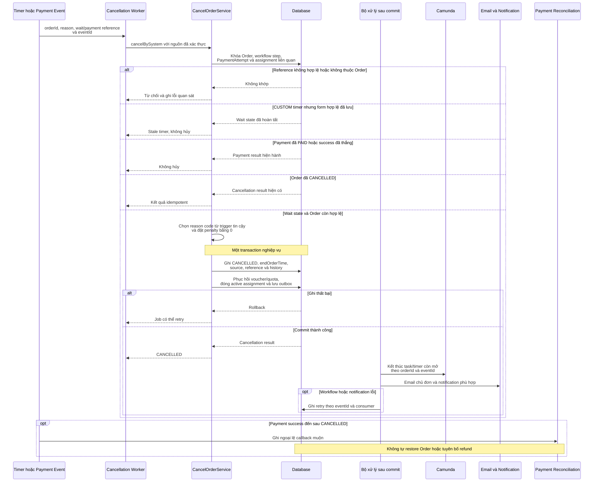

# WF09 — Biểu đồ tuần tự

Nguồn: [đặc tả](usecase.md) · [Activity Diagram](diagram.md) · [Use Case tổng quát](overview.svg).

Tên CancelOrderService, ReputationLedger, VoucherRestoration và worker dưới đây là vai trò kỹ thuật đề xuất. Mọi nguồn phải gọi cùng application service để không tạo nhiều cách cập nhật Order.

## UC09.1 — Khách chủ động hủy Order

Không participant nào thực hiện hoàn stock hoặc refund. Guest token không được đưa vào outbox, log hay notification payload.

## UC09.2 — Manager từ chối Order

Manager reject là nhánh của review `PENDING_APPROVAL`, không phải endpoint cho manager hủy bất kỳ Order nào.

## UC09.3 — Hệ thống hủy do timeout/payment fail

Timer, webhook, form hợp lệ và staff-start phải dùng version/khóa chung ở các application service. Không được để mỗi delegate tự cập nhật trạng thái theo một quy tắc khác.
